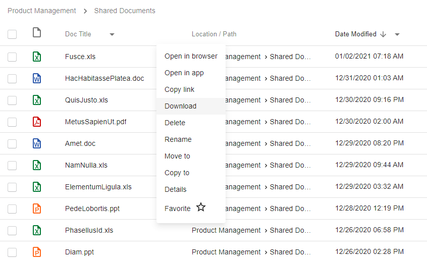
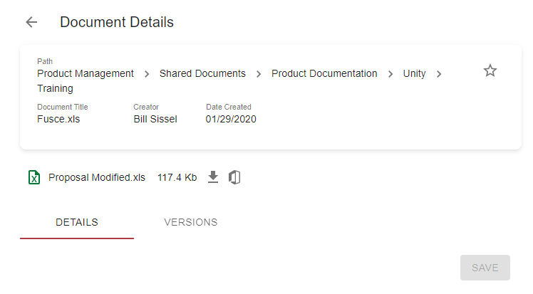

# Description

This feature allows downloading document.

# How to Download a Document

## Download a document from Grid

- Click on context menu icon of the document, that should be downloaded

- Click `Download` action

    

Browser will start downloading document or show 'Save as' dialog.

## Download a document from Document Details

- Open `Document Details` by clicking row in grid / selecting `Details` action from context-menu / opening document 
in a separate tab ...

- Click on the arrow down icon:

    

Browser will start downloading document or show 'Save as' dialog.

# Configuration

[Download action configuration](../../configuration/actions/download-document.md)