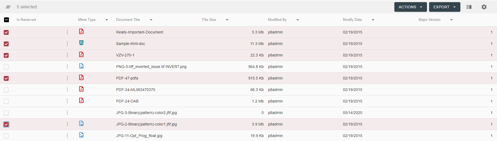
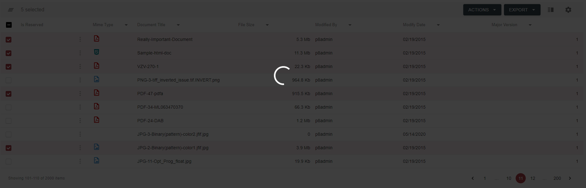
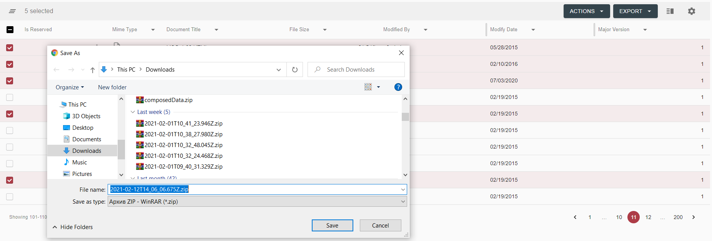
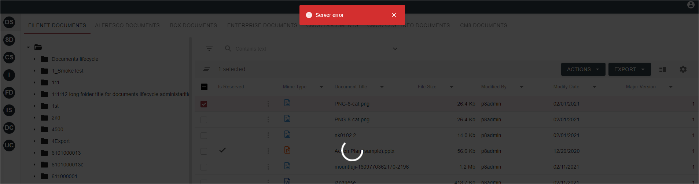

# Description

`Multiple Documents Download` feature allows downloading multiple documents as a zip archive.

# How to Download Multiple Documents

To Download Multiple Documents:

- Using row checkboxes or Select All checkbox in the grid header, select documents that should be downloaded:

    

- Select `Multiple Download` from Actions bulk mode menu in the grid toolbar:

    
    
- Then user will see loader with a backdrop, while request is processing:

    
    
- After that user will be prompted to save an archive:

    
        
- If anything has gone wrong, error message will be displayed:

    

# Configuration

[Multiple Documents Download action configuration](../../configuration/actions/multiple-document-download.md)