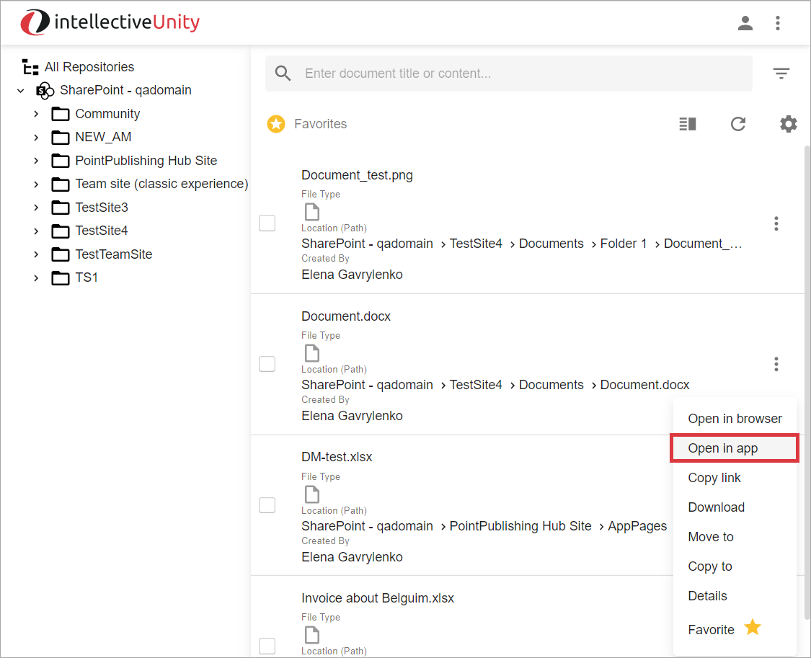
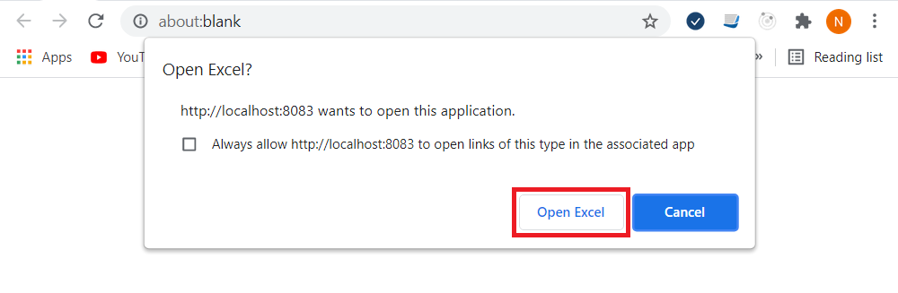
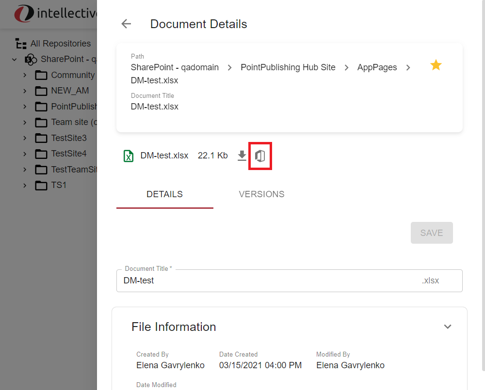
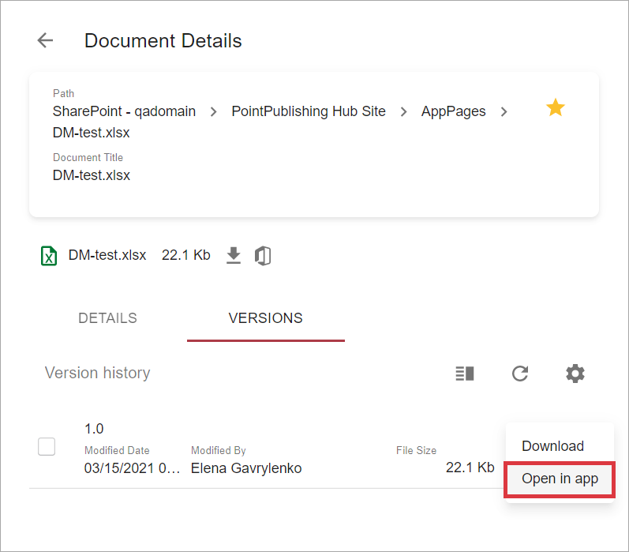

# Description

`Open in app` feature allows to  open either SharePoint document or document version in 
Microsoft Office desktop application.

# How to Open a SharePoint Document in Desktop Application

A document can be opened from either grid or [Document Details](./document-details.md).

To open a document from the grid:

- Open actions menu by clicking on the vertical ellipse icon consisting of three dots in the grid row and select 
`Open in app` action from dropdown list:

    
    
- It will open a new browser tab with confirmation dialog:

    
    
    Confirm by clicking `Open` button. You may also check `Always allow ...` checkbox to skip the confirmation 
    in the future.

To open a document from `Document Details`:

- Open [Document Details](./document-details.md)

- Press `Open in app` button on `Document Details` view:                            

   
   
# How to Open a SharePoint Document Version in Desktop Application

- Open [Document Details](./document-details.md)

- Switch to `Versions` tab.

- Open actions menu by clicking on the vertical ellipse icon consisting of three dots in the grid row and select 
  `Open in app` action from dropdown list:
  
  
  
- It will open a new browser tab with confirmation dialog:
  
    

    Confirm by clicking `Open` button. You may also check `Always allow ...` checkbox to skip the confirmation 
    in the future.
    
|**Note:** SharePoint opens previous versions in read only mode.

# Configuration

[Open in desktop app action configuration](../../configuration/actions/open-in-desktop-app.md)    
