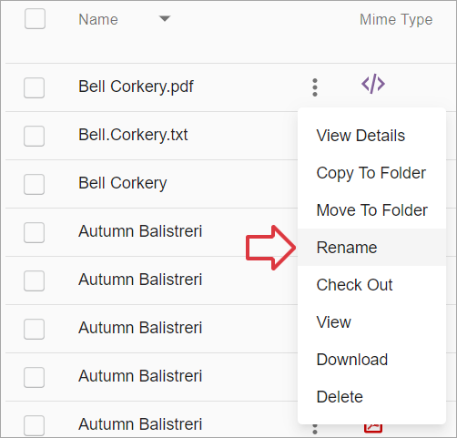
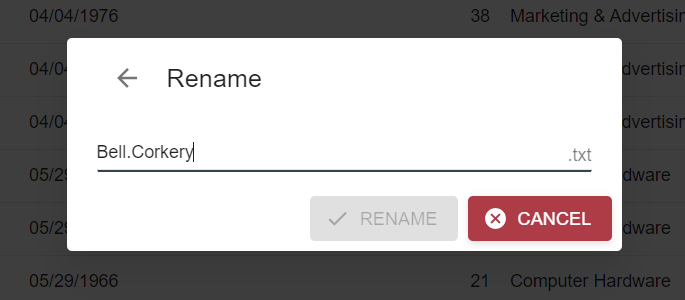
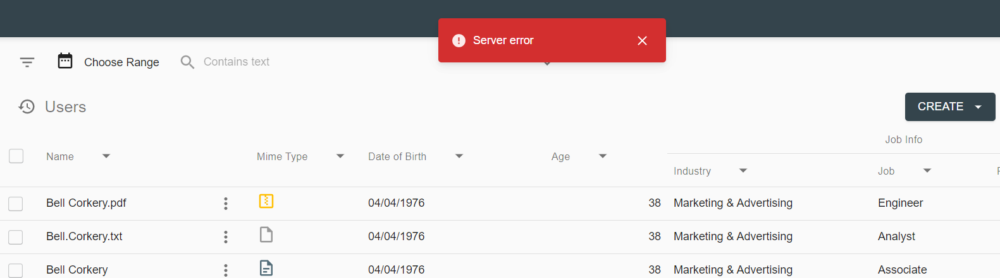
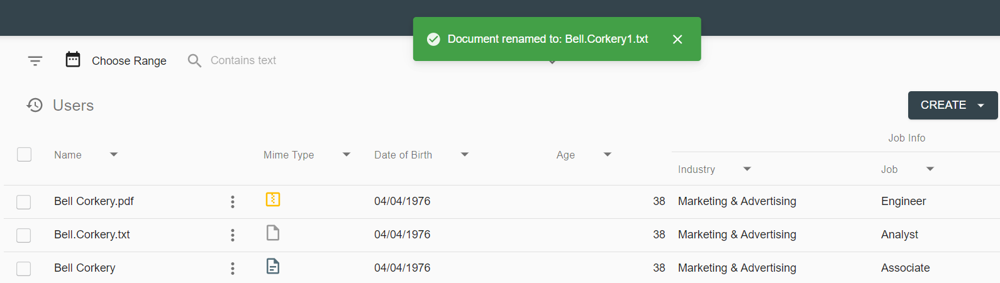

# Description

`Rename a File` feature allows to change document file name. It can be executed from grid context-menu. The file name property is defined in action configuration.

The string portion after last dot character is considered as file extension and is not changable.

# How to Rename a File

- Click on context menu icon of the document, that should be renamed

- Click `Rename` action:

     

- Rename dialog will appear. Change the name and click `Rename` button:

     

- In case of failure toast with error message `Server error` appears:

     

- If no errors occurred during action execution, user will see the message `Document renamed to: ...`, the action completed successfully:

     

Successful action execution will also lead to grid refresh.

# Configuration

[Rename File action configuration](../../configuration/actions/rename-file.md)