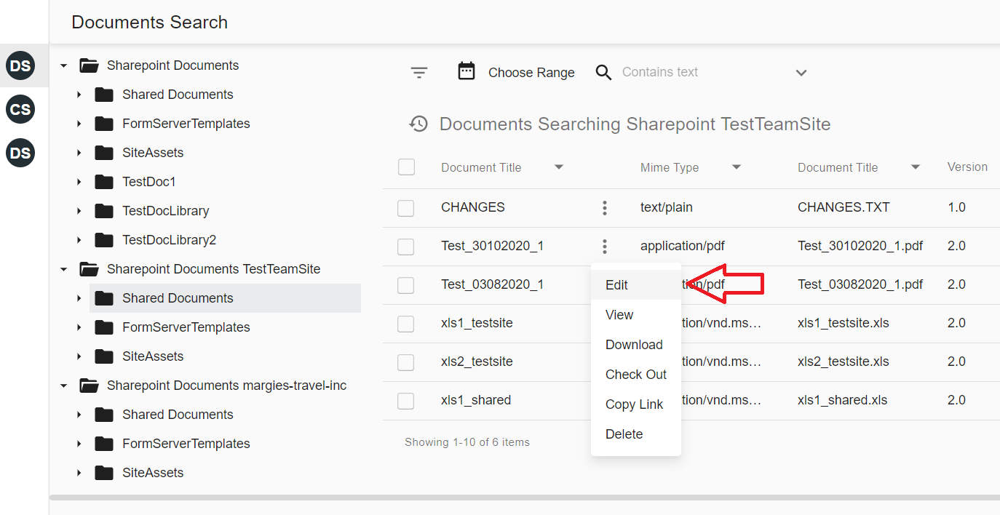
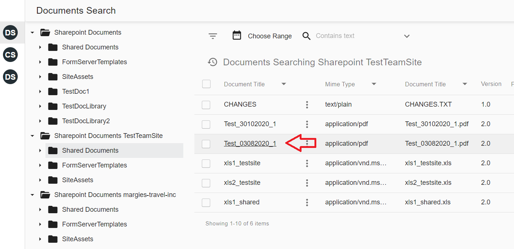
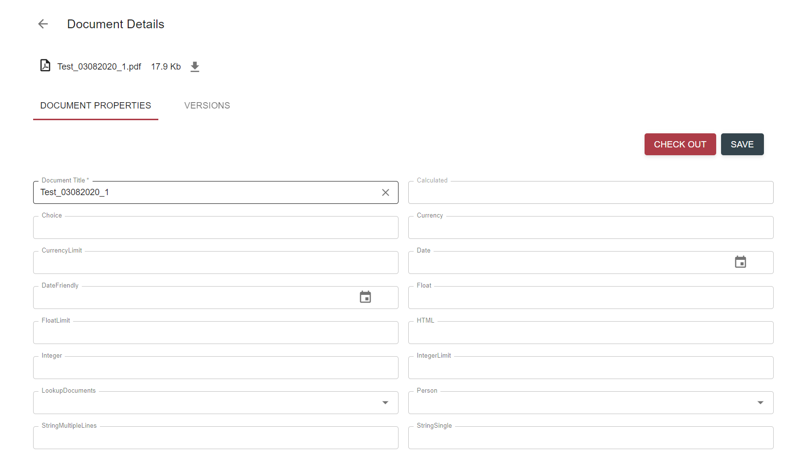

# Description

View document action allows to 

- view document properties

- view versions

- perform some actions on document like check out, check in, cancel check out, view content, download, delete, 
open in office, etc. List of document actions depends on action view configuration and data provider

- perform some actions on document versions like promote / demote / make version current / delete version. List of 
actions depends on configuration and data provider

# How to view document properties

- Click on context menu icon of the document, and select `Edit` action

    
    
    Alternatively just click on link in favorite column:
    
    
    
- Document Details view will appear:

    
   
# Configuration

[View document action configuration](../../configuration/actions/view-document.md)
