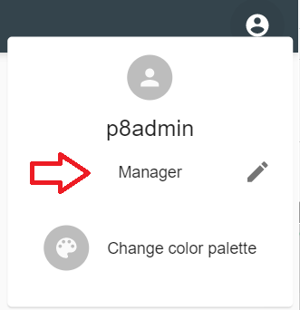
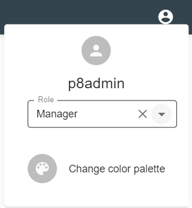
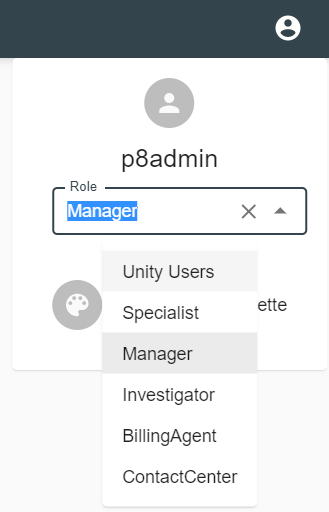
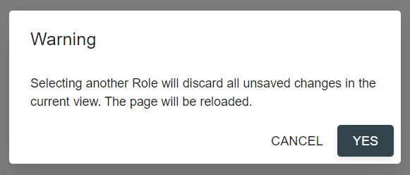

# Overview

*content to be added*

# User Preferences Features

## Choosing User Role

The feature allows a user to change a role to focus on only those [dashboards](../../configuration/dashboards.md), 
[components](../../configuration/dashboards/component-tag.md) and [actions](../../configuration/actions.md) 
related to that role. 
It's available on `Account Settings` popup menu:

To change a user role click on  icon. 
It will show a dropdown with non-system user roles:

 

 

`All` role, which represents all roles assigned to the user account, can be set by removing current selector value, 
i.e. by clicking  icon. If due to 
[System Properties Configuration](../../configuration/basic-steps/system-properties.md) `All` role is disabled, 
dropdown will be not clearable.

Selecting and clearing the role will lead to page reload after user clicks on `Yes` button of confirmation modal:

**Notes**: 
- If user changes role on analytics page, he will be redirected to `/<context-root>/analytics`.
- If user changes role on main.jsp page, he will be redirected to `/<context-root>/main.jsp`.
- This feature is disabled for case when role mode is `RoleUnion` in 
[System Properties Configuration](../../configuration/basic-steps/system-properties.md) section.

See [Access Roles Configuration](../../configuration/tags-list/access-roles-tag.md) for details on roles configuration.

## Choosing Theme

*content to be added*