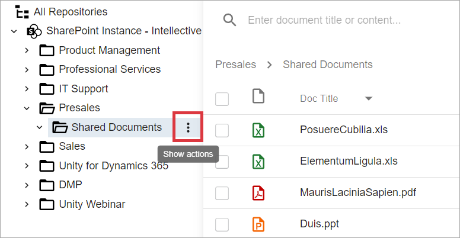
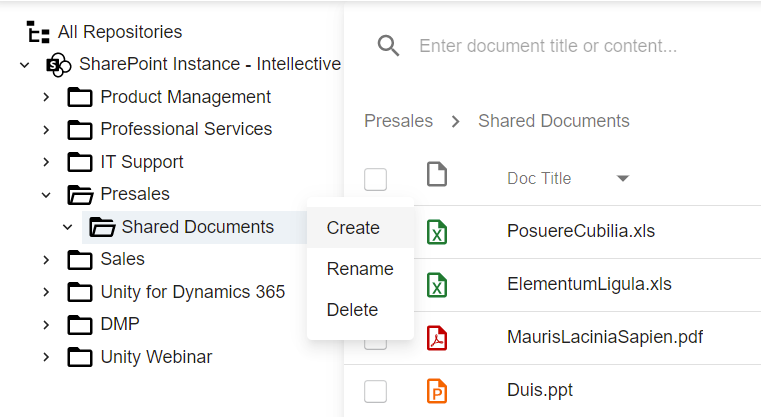
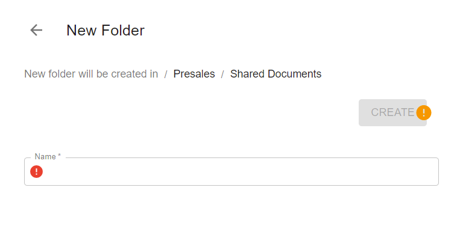

# Description

`Create folder` action allows to create a folder as a child of selected folder. It can be executed from a foldersView component if user has appropriate permissions.

# How to create a folder

- Find a folder you are going to create in a foldersView component. Hover mouse over folder name and perform the right click:

  

- Select `Create` action from dropdown list:

  

- New Folder view opens with a path to selected folder and `Name` input:

  

- Provide a value for `Name` field and click `Create` button. After the action is successfully completed, selected folder in the tree view component will be refreshed to display changes.
    
# Configuration

[Create Folder action configuration](../../configuration/actions/create-folder.md)  
