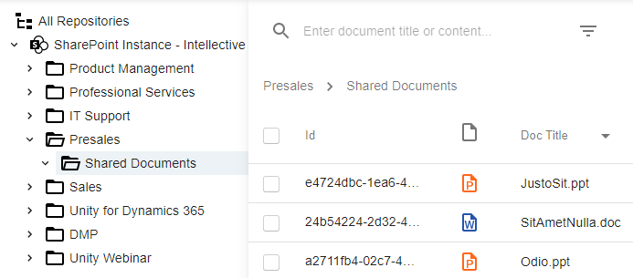
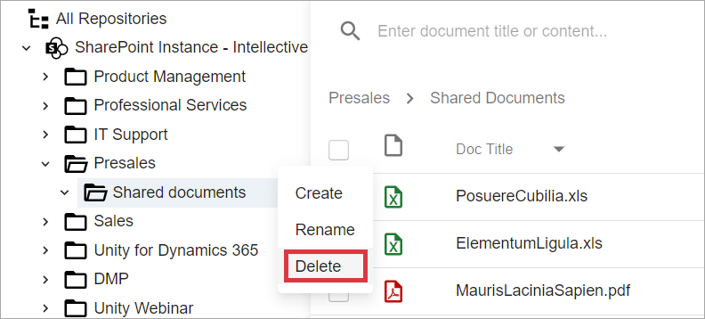
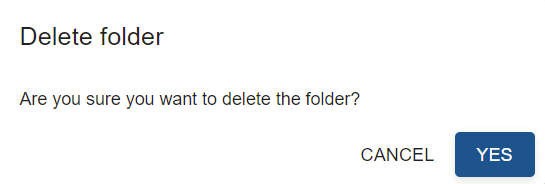

# Description

`Delete` folder action allows to delete a folder and it's content from repository data provider. It can be executed from a tree view component on a folder if user has appropriate permissions. 

# How to Delete a Folder

- Find a folder you are going to delete in tree view component. Put mouse cursor on top of the folder and  click on the vertical ellipse icon consisting of three dots in the folder row:

  

- Select Delete action from dropdown list:

  

- Confirmation dialog will appear:

  

Clicking on `Cancel` button will lead to closing confirmation dialog without folder deleting.

By selecting `Yes` button, user triggers `delete` action execution. After folder is deleted, parent folder in the tree view component will be refreshed to reflect delete of the folder. 

# Configuration

[Delete Folder action configuration](../../configuration/actions/delete-folder.md)
