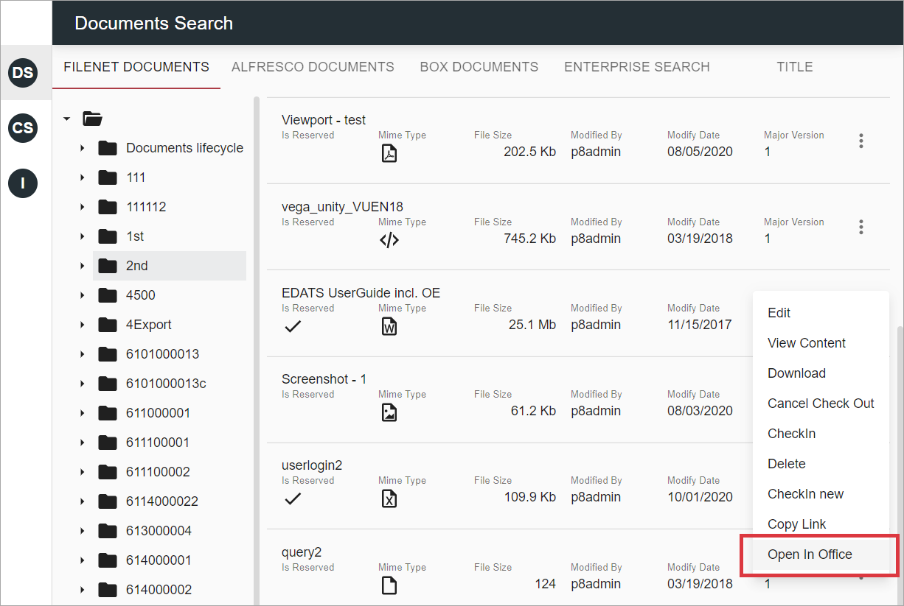
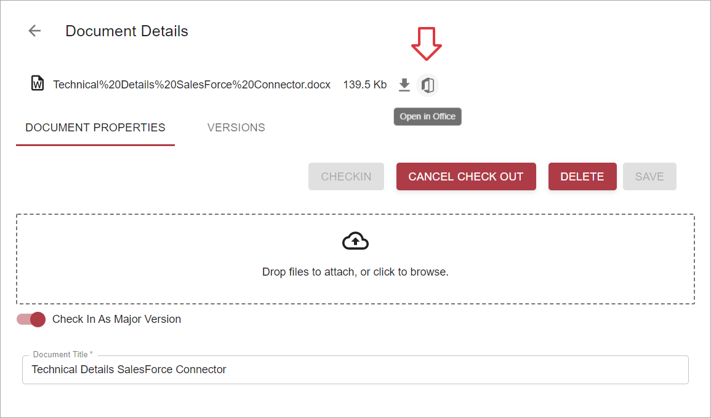

# Overview

Unity Office Plugin allows to open Word, Excel and Powerpoint documents in MS Office desktop application with further 
ability to perform some additional actions, e.g.  
- update and check in the document
- cancel check out and close the document
- view document properties
- save opened document as a new one

# React UI: Open Action

2 types of `Open` actions were implemented for React UI:  
- `Open in Office`  
    This action is enabled for checked out documents.
- `Check Out and Open in Office`  
    This action is available for non-reserved documents and allow to check out and open selected document.

User should have `view` rights in order to open a document.

Actions are available from grid context menu depending on document reservation status:

 

For configuration details see [Open in Office actions configuration](../../configuration/actions/open-in-office.md).  

`Open in Office` action is also available on `Document Details` view:

No additional configuration is required. This button will appear automatically if both conditions matches:

1. The document is being kept in data provider, that is supported by plugin
2. Document's mime type allows to open it in Word/Excel/Powerpoint application

# Supported Data Providers

FileNet, CMIS and Enterprise Search. For Enterprise Search those actions are only available for CE and CMIS documents.

CMIS creates a working copy on check out action, so for reserved document we actually have 2 records in a grid, 
the original one and it's working copy:

    
`Open in Office` action is available for both of them and always opens a **working copy** in Office application, since 
versioning actions are not allowed for the original one. This principle is also applicable for situation when user is
executing open action from `Document Details`: no matter which record has been selected for editing, working copy
will be opened via Office Plugin. 

# Plugin Version

Minimum plugin version is 1.1.36.
