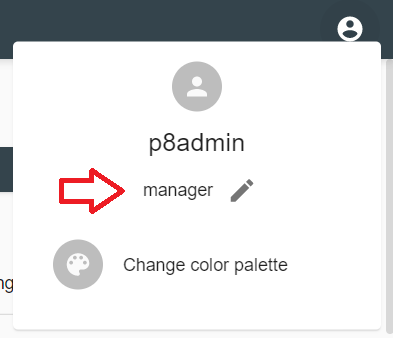
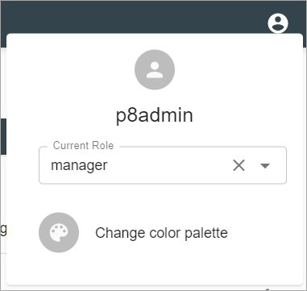
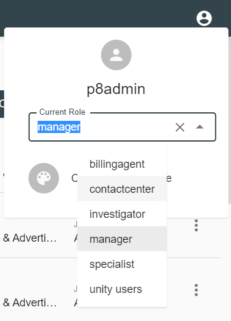
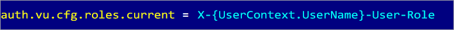

# Description

The feature allows a user to change a role to focus on only those [dashboards](../../configuration/dashboards.md), 
[components](../../configuration/dashboards/component-tag.md) and [actions](../../configuration/actions.md) 
related to that role. 
It's available on `Account Settings` popup menu:

Current user role here is `Manager`.

# How to Change User Role

- On `Account Settings` popup menu click on  icon, selection tools appear:  
    
     

- Open a dropdown with non-system user roles:
    
     
    
- Select user role from a dropdown list or set `All roles` by clicking  icon:
    
      
    
    `All roles` represents all roles assigned to the user account. If `All roles` is selected, all available dashboards, components and actions are shown in user interface.
    
- Click `Yes` button of confirmation modal with warning `Selecting another Role will discard all unsaved changes in the current view. The page will be reloaded`:
    
    
    
    The page will be reloaded with selected user role.

**Notes**: 
- If user changes role on analytics page, he will be redirected to `/<context-root>/analytics`.
- If user changes role on main.jsp page, he will be redirected to `/<context-root>/main.jsp`.
- If `All roles` is disabled in [System Properties Configuration](../../configuration/tags-list/system-properties-tag.md), dropdown will be not clearable.
- This feature is disabled for case when role mode is `RoleUnion` in 
[System Properties Configuration](../../configuration/tags-list/system-properties-tag.md) section.

# Limitation

This feature is available OOTB, but requires customization in case requests to Unity are sent via Gateway. 
A specific user role header should be added to each request in this case. Public API retrieves it from the 
header and applies to current user context in order to show only those [dashboards](../../configuration/dashboards.md), 
[components](../../configuration/dashboards/component-tag.md) and [actions](../../configuration/actions.md) 
related to that role.

The name of header is `X-{UserContext.UserName}-User-Role` by default. It supports macros, where `UserContext.UserName` 
is current user name. Header name is stored in `auth.properties` file and can be modified:

# Configuration

This feature is available OOTB, but requires [customization](choosing-user-role.md#limitation) in case requests to Unity are sent via Gateway. 

[Access Roles Configuration](../../configuration/tags-list/access-roles-tag.md)
