|**Note**: Unity Installation is the same for Unity ExtJS and Unity React.

# Introduction

This guide will cover WebSphere, WebLogic and jBoss/Wildfly specific deployments. You should follow the guides for the platform you will use for your deployment.
Once Unity is deployed, you can install and integrate additional components as needed in your planned Unity application such as Unity Intelligence Engine, a plug-in for Microsoft Office, or the User Audit module.

For the minimum third-party software applications required for setting up the infrastructure, see the [Unity 7 System Requirements](system-requirements.md).

For instructions on installing the Unity Enterprise Search, see:
- [Prerequisites for Enterprise Search Installation](../../enterprise-search/installation/prerequisites.md)
- [Enterprise Search Installation](../../enterprise-search/installation/installing-enterprise-search.md)

Unity is a flexible application with many installation options. Installation is a straightforward process once the supporting infrastructure is in place. It is highly recommended you read through the entire implementation guide to fully understand all options and decisions to make when planning your Unity installation.
The Unity distribution package includes pre-built EAR (Enterprise Application aRchive) files for IBM WebSphere and Oracle WebLogic.
You'll need to download the deployment files, prepare them for your system, then use a form_app authentication method to deploy the package and all its modules simultaneously to your application server.

# Versions Supported

The installation guide applies to all Unity 7 release versions unless otherwise indicated. 

- Unity 7.0
    - All 7.0 releases
     
- Unity 7.1
    - All 7.1 releases
        - 7.1.0 has added the IBM Case Manager Proxy support to allow for ICM to run on a different server. This is now configured during the installation.  Previous versions do not support this feature. 
    
- Unity 7.2
    - All 7.2 releases
        - In 7.2.0 Office Integration plug-in has changed – registry key is added on the user’s machine and application works in the background. In addition to the system changes, the Office Integration plug-in now support IE, Chrome and Firefox browsers. Previous versions worked via ActiveX object and in IE only. 
        - UCM Login module and datasources should be configured
        - WebLogic supported
        - JBoss Supported – either Wildfly (a.k.a JBOS AS) or JBOSS ERP
    
- Unity 7.5
    - All 7.2 releases
        - FileNet connector supporting for Unity under JBoss
 
- Unity 7.6
     - All 7.6 releases
        - Configuration Console: Search users and groups in LDAP

# Download the Deployment Files

Each EAR file contains a complete Unity application package with one or more modules in a single archive.

To download the deployment files:

1. Create a folder on your system called `<vu_install>`.

2. Download the UNITY Archive ZIP file from the FTP server.

3. Unzip the UNITY Archive ZIP file to your folder.

4. Navigate to the folder below that uses your application server and confirm the EAR files downloaded correctly: 
    - For WebLogic: `<vu_install>\VegaUnity\packages\webLogic`
    - For WebSphere: `<vu_install>\VegaUnity\packages\webSphere`
    
        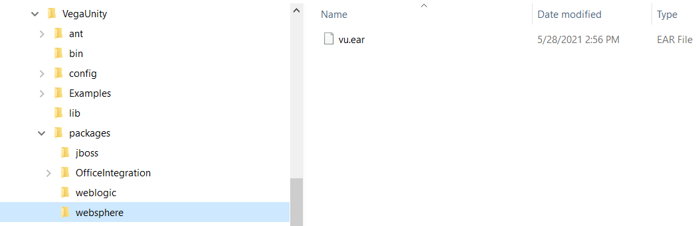

The above EAR files are pre-packaged with `form_app` authentication method and ready for deployment without any additional steps. 

The IBM FileNET CE client version is 5.2

Additionally, these EAR files have built-in Enterprise Search connector support (provider class: `com.vegaecm.vu.providers.uie.hli.Provider` or `com.vegaecm.vu.providers.ves.hli. Provider`  (deprecated name) or `com.vegaecm.vspace.providers.ves. VesQueryProvider` (deprecated name)).

# Unity Master Key Configuration

## Master key

The application wide Unity master key is used to encrypt/decrypt arbitrary values at Unity configuration file.  
This key is defined either at application's web.xml file or via java runtime property (-Dkey=value) for the whole application server  
where Unity is deployed.

Before actual usage, the Unity master key should be configured to enable values encryption at the Unity configuration files.

The Unity master key can be generated either before Unity deployment via command line utility or when Unity already deployed and running via 
Unity Configuration Console UI.

## Generate master key with command line utility

1. Extract Unity distribution ZIP package into some temporary directory and go to the `VegaUnity/bin` folder.  

2. Use either `encryptionSupport.cmd` (on Windows) or `encryptionSupport.sh` (on Linux) to generate the Unity master key.  
    This is a general purpose utility, so the following command line arguments should be used to execute actual key generation:

    ```
    -generateKey -alphanum -cipher AES256
    ```
 
    - `-generateKey` argument selects the actual operation to be executed
    - `-alphanum` argument forces the utility to generate key with only alphanumeric characters
    - `-cipher AES256` argument specifies the cipher type (supported values: 3DES, AES256, AES)

For example:  
```
C:\tmp\Unity_7.7.2\VegaUnity\bin>encryptionSupport.cmd -generateKey -alphanum -cipher AES256
---------------------------------------------------------
| Encryption type: AES256
---------------------------------------------------------
ZjJwRjFHZ04yM091bUJrb0t3amFHUTViNkVqU280RE0=
```

## Generate master key with Unity Configuration Console UI

The master key can be generated through the dedicated UI dialog at Unity Configuration Console. 
 
1. Login to the Unity with the user with the rights to access the Configuration Console tab.  

2. Go to the Configuration Console tab and locate the `Encrypt value` button at the main toolbar at the right.  

3. Press that button and the `Encrypt Value` dialog will appear.  

4. Select the encryption type using `Encryption` radio control and then press the `Generate key` button at the bottom of this dialog.  

The generated master key will be displayed at the new `Generated key` popup window:

 


## Use generated master key for Unity instance deployment

### Master key at application's web.xml file

In this case, the master key is specified at application's `web.xml` file in the same way as the location of main Unity configuration  
file (`vSpaceConfigURL` one).  
The following env entry names can be used for that purpose (each next item at the list can be used to override key from the item before):  

- `encryptionKeysFile`. This value points to the location of encryption keys file. See the file format description below.
- `vuKey` (pre Unity 7.7.2 approach). This is exact value of AES256 encryption key.

For example:
```xml
<?xml version="1.0" encoding="UTF-8"?>
<web-app id="VegaUnity" version="2.4" xmlns="http://java.sun.com/xml/ns/j2ee"
         xmlns:xsi="http://www.w3.org/2001/XMLSchema-instance"
         xsi:schemaLocation="http://java.sun.com/xml/ns/j2ee http://java.sun.com/xml/ns/j2ee/web-app_2_4.xsd">

...
    <env-entry>
        <env-entry-name>encryptionKeysFile</env-entry-name>
        <env-entry-type>java.lang.String</env-entry-type>
        <env-entry-value>C:/wlp/usr/servers/Vu7/keys/unity_master_keys.txt</env-entry-value>
    </env-entry>
...

</web-app>
```

or

```xml
<?xml version="1.0" encoding="UTF-8"?>
<web-app id="VegaUnity" version="2.4" xmlns="http://java.sun.com/xml/ns/j2ee"
         xmlns:xsi="http://www.w3.org/2001/XMLSchema-instance"
         xsi:schemaLocation="http://java.sun.com/xml/ns/j2ee http://java.sun.com/xml/ns/j2ee/web-app_2_4.xsd">

...
    <env-entry>
        <env-entry-name>vuKey</env-entry-name>
        <env-entry-type>java.lang.String</env-entry-type>
        <env-entry-value>ZjJwRjFHZ04yM091bUJrb0t3amFHUTViNkVqU280RE0=</env-entry-value>
    </env-entry>
...

</web-app>
```

The encryption keys file is the plain text file that contains the list of master keys for each supported encryption algorithms (3DES, AES and AES256).  
For example:

```text
3DES=s1f449/mMbbLi423f78LmFTltQRPx83x
AES=ZGVmYXVsdCBhZXMxMjgga2V5LCBwbGVhc2U4643wbGFjZSBpbiBwcm9kdWN0aW9u
AES256=ZjJwRjFHZ04yM091bUJrb0t3amFHUTViNkVqU280RE0=
```

### Master key at java runtime properties

In this case, the master key is specified via java runtime property (-Dkey=value) for the whole application server.  
The following java runtime properties can be used for that purpose (each next item at the list can be used to override key from the item before):  

* `encryptionKeysFile` (-DencryptionKeysFile=_file_path_). This value points to the location of encryption keys file. See the file format description above.
* `uKey.AES256` (-DuKey.AES256=_key_value_). This is exact value of AES256 encryption key.
* `uKey.3DES` (-DuKey.3DES=_key_value_). This is exact value of 3DES encryption key.
* `uKey.AES` (-DuKey.AES=_key_value_). This is exact value of AES (AES with 128 bits key) encryption key.
* `uKey` (-DuKey=_key_value_). This is alias for `uKey.AES256` java runtime property.

# Deploy the Application on WebSphere

The instructions in this section only apply if you're using an IBM WebSphere application server. You need to have administrator access to the WAS console so you can configure the global security and install the application.

If you're using Oracle WebLogic, see [Deploy the Application on WebLogic](#deploy-the-application-on-weblogic).

## Configure the global security

The Global Security is the default security policy for all WebSphere applications. You need to add Enterprise Security and the Filenet JAAS Login Modules to your Global Security settings to ensure it receives the same security policy.

To configure the Global Security:

1. Open the WAS administrative console at the following path where `<ServerName>` is the name of your server:  
    `http://<ServerName>:9060/ibm/console`

2. Log into the system.

3. From the left navigation, open `Security > Global security`.

4. In the `Authentication` section, expand `Java Authentication and Authorization Service`:
 
    

5. Select `Application logins`.

6. Click `New…`.

7. For `Alias`, enter VES:

    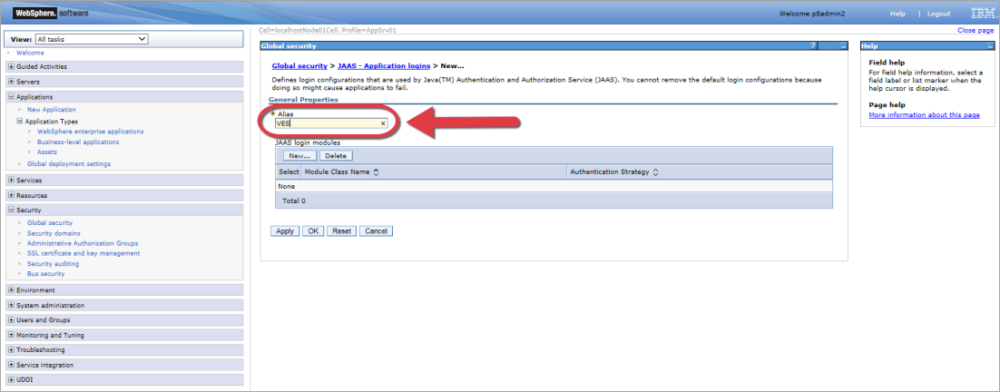

8. Click `Apply`.

9. Click `Save`.

10. In the JAAS Login Modules section, click `New…` and add the following login modules:

    |JAAS login module alias |	Module Class Name	|Authentication Strategy	|Module Order|
    |:-----------------------|:---------------------|:--------------------------|:-----------|
    |FileNetP8WSI	         |com.filenet.api.util.WSILoginModule	|REQUIRED	|1|
    |FileNetP8	             |com.ibm.ws.security.common.auth.module.WSLoginModuleImpl| REQUIRED	|2|
 
    
    
11. Click `Apply`, then `OK`.

## Configure WebSphere for WAS 8

To run Unity application at WAS 8, you need to set the following configuration property:

`com.sun.jersey.server.impl.cdi.lookupExtensionInBeanManager = true`

To configure WebSphere for WAS 8:
1. Open the WAS administrative console at the following path where `<ServerName>` is the name of your server:
    `http://<ServerName>:9060/ibm/console`.

2. Log into the system.

3. From the left navigation, open `Application Servers > [server] > Process definition > Java Virtual Machine > Custom properties`.

4. If it’s not listed, add the following property: 
    `com.sun.jersey.server.impl.cdi.lookupExtensionInBeanManager`.

5. Set `com.sun.jersey.server.impl.cdi.lookupExtensionInBeanManager = true`:
 
    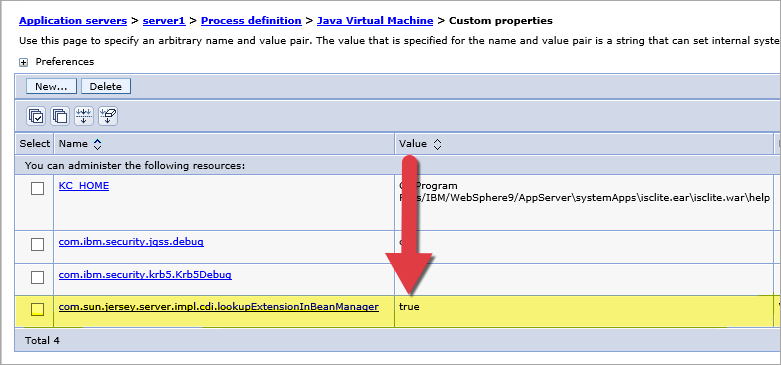
    
## WAS9 additional configuration for working with CMOD

### Create Shared Library

1. Open WAS9 administrative console.

2. Select `Environment > Shared libraries` section.

3. Select scope and press `New` button.

4. Set unique library name in the `Name` field.

5. Add full path to the `Classpath` section for the following files:
   - `ODApi.jar`
   - `libars3wapi32.so`
   - `libars3wapi64.so`
   - `gson-2.8.1.jar`
   
   Use appropriate files for Windows instead of `libars3wapi32.so` and `libars3wapi64.so`.

6. Add full path for On-Demand files to the `Native Library Path` section.

7. Check `Use an isolated class loader for this shared library` in the `Class loading` Section:

    
     

8. Press `Apply`.

9. Click on `Save` link.

10. Restart WAS9.

### Use Shared Library in Unity

Created Shared Library should be used in the installed Unity application:

1. Open WAS9 administrative console.

2. Select `Applications > Application Type > WebSphere enterprise applications`.

3. Click on `Unity` application.

4. Click on `Shared library references` link:

    
     
5. Select `Intellective Unity` module.

6. Press `Reference shared libraries` button.

7. Selected created Shared Library with CMOD files:

     

8. Press `OK` button.

9. Press `OK` on Shared library references window:

    
     
10. Click on `Save` link:

    
     
11. Restart Unity application.

## Install using the Fast Path method

The Fast Path method focuses entering basic information, mapping modules to servers, and mapping virtual hosts for web modules. 

It applies the default settings for everything else. Many of these settings can be changed after installation as needed.

To install Unity using the Fast Path method:

1. Open the WAS administrative console at the following path where `<ServerName>` is the name of your server: `http://<ServerName>:9060/ibm/console`.

2. Log into the system.

3. From the left navigation, expand `Application > Application Types`, then select `WebSphere enterprise applications`.

4. Click `Install`.

5. On the `Preparing for application installation` screen click `Browse...` and select the `vu.ear` file from your `<vu_install>` or `<ves>` folder (depending on your Unity implementation).

6. Click `Next`:
 
    

7. For `How do you want to install the application?`, select `Fast Path` and click `Next`:

    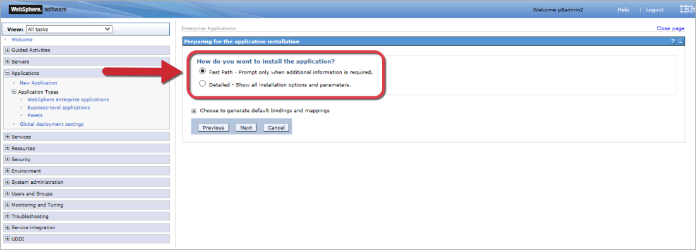

8. In the `Select installation options` screen, enter an `Application name` and click `Next`:

    | **Note**: You cannot edit this name after installation.      

    
        
9. On the `Map modules to servers` screen, click `Next`.

10. On the `Map virtual hosts for Web modules` screen, click `Next` again.

11. Review the `Summary` section, then click `Finish` and `Save`:
 
    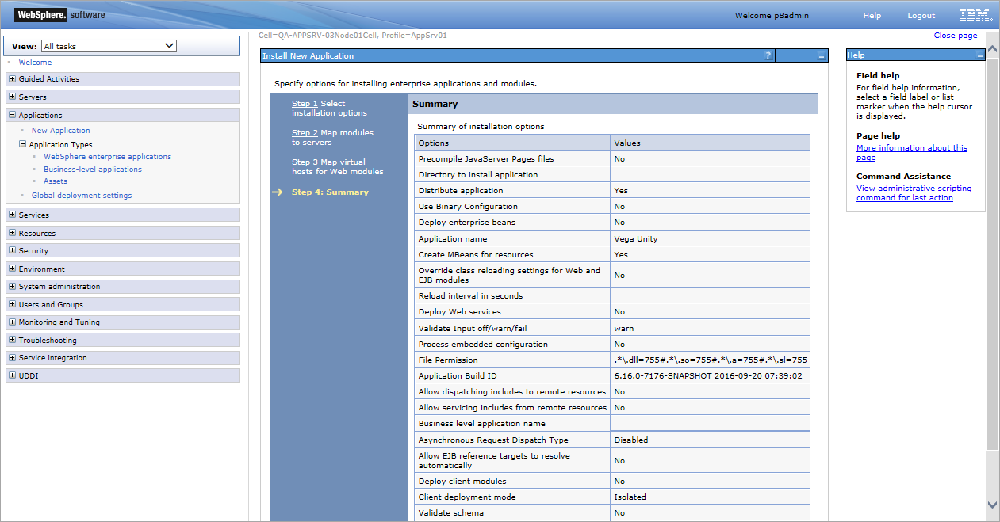
    
12. If you need to change the Context Root, complete the following:
    
    a. Return to the `WebSphere enterprise applications` screen.
    
    b. Select your new Unity application name.
    
    c. Click `Context Root` For Web Modules.
    
    d. Edit the Context Root:
 
       
    
    e. Click `OK`, then click `Save`:
 
       
    
13. If you are using IBM Case Manager you will need to configure the Proxy Manager Connection string for Case Manager, complete the following:
    
    a. Return to the `WebSphere enterprise applications` screen.
    
    b. Select your new Unity application name.
    
    c. Click `Initialize parameters for servlets`.
    
    d. Edit the targetUri to connect to your IBM Case Manager Installation. The format is `http://<server IP>:<port>/CaseManager/`:

       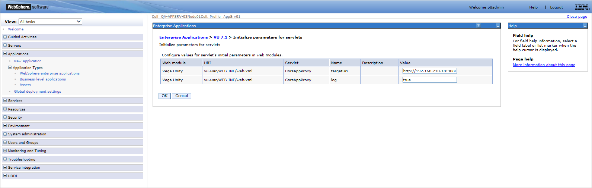
    
    e. Click `OK`, then click `Save`:
 
       
    
14. Select the Unity application and click `Start`.
  	
## Install using the Detailed method

The Detailed method gives you a chance to review and configure all the possible settings for the installation including focuses entering basic information, mapping modules to servers, and mapping virtual hosts for web modules. It applies the default settings for everything else. Many of these settings can be changed after installation as needed.

If you have already installed the application using the Fast Path method, you do not need to complete this section.

To install Unity using the Detailed method:

1. Open the WAS administrative console at the following path: `http://<ServerName>:9060/ibm/console` where `<ServerName>` is the name of your server.

2. Log into the system.

3. From the left navigation, expand `Application > Application Types`, then select `WebSphere enterprise applications`.

4. Click `Install`.

5. On the `Preparing for application installation` screen click `Browse...` and select the `vu.ear` file from your `<vu_install>` or `<ves>` folder (depending on your Unity implementation).

6. Click `Next`:
 
    
    
7. For `How do you want to install the application?`, select `Detailed` and click `Next`.

8. In the `Select installation options` screen, enter an `Application name` and click `Next`: 

    

9. Edit the module targets on the `Map modules to servers` screen as needed and click `Next`.

10. Edit the settings on the `Provide JSP reloading options for Web modules` screen as needed and click `Next`.

11. Edit the shared libraries for the application and modules on the `Map shared libraries` screen as needed and click `Next`.

12. Edit the asset or composition IDs for reference on the `Map shared libraries relationships` screen as needed and click `Next`.

13. Edit the targetUri to connect to your IBM Case Manager Installation. The format is `http://<server IP>:<port>/CaseManager/` and click `Next`:
 
    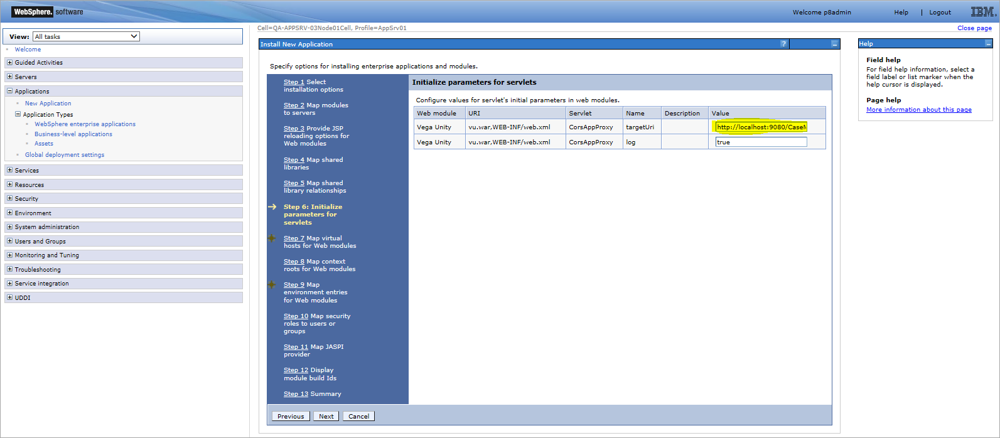

14. Edit the virtual hosts on the `Map virtual hosts for Web modules` screen as needed and click `Next`.

15. Edit the Context Roots on the `Map context roots for Web modules` screen as needed and click `Next`:
 
    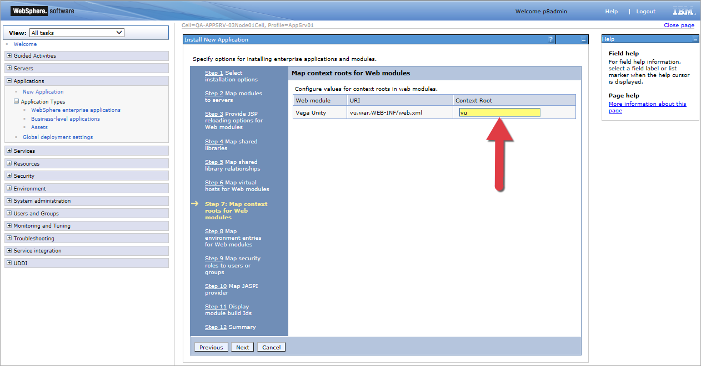

16. Edit the `vSpaceConfigURL` value on the `Map environment entries for Web modules` screen as needed and click `Next`:
 
    
    
17. Edit the users and groups on the `Map security roles to users or groups` as needed and click `Next`.

18. Edit the JASPI providers on the `Map JASPI provider` screen as needed and click `Next`.

19. Review the build IDs on the `Display module build Ids` screen and click `Next`.

20. Review the `Summary` section, then click `Finish` and `Save`:
 
    

21. Replace the default `jaceXXX.jar` and `peXXX.jar` files in `<installed app>/WEB-INF/lib` with the `FileNet Jace.jar` and `pe.jar files`.

22. Return to the `WebSphere enterprise applications` screen, select your new Unity application name and click `Start`.

# Deploy the Application on WebLogic

The instructions in this section only apply if you're using an Oracle WebLogic application server. You need to have administrator access to the WebLogic Administrator console so you can configure the modules and install the application.
If you're using IBM WebSphere, see [Deploy the Application on WebSphere](#deploy-the-application-on-websphere).	

## Install the application EAR file	

To install Unity for WebLogic:

1. Open the `vu.ear` file and edit the `Connection String for Case Manager`, the `Context Root` and `Configuration File Path` values as needed. Default values are: 
    - Context-root = `vu`
    - Configuration file path = `file:///opt/vu/vega_unity.xml`
    - Connection String for Case Manager = `http://localhost:9080/CaseManager/`

2. Open the WebLogic administrative console at the following path: `http://<ServerName>:7011/console/console.portal` where `<ServerName>` is the name of your server.

3. In the `Domain Structure` section, select `Deployments`.

4. Click `Install`.

5. On the `Preparing for application installation` screen click `Browse...` and select the vu.ear file from your `<vu_install>` or `<ves>` folder (depending on your Unity implementation.)

6. Click `Next`.

7. In the `Path` field, enter the file location of the `vu.ear` file:
 
    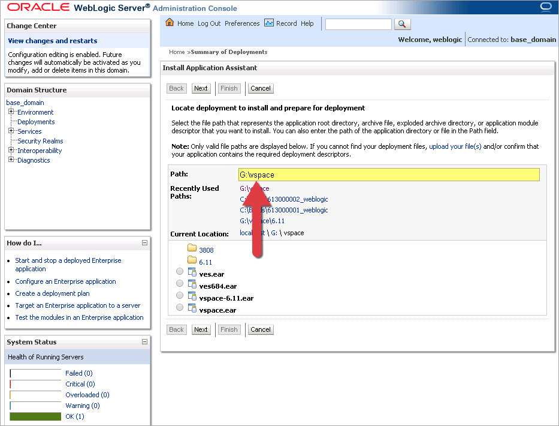
    
8. Select `vu.ear` and click `Next`.

9. Select `Install this deployment as an application` and click `Next`:
 
    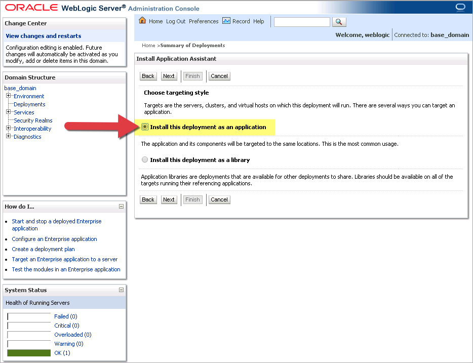
    
10. Edit the `Name` as needed and click `Next`:
 
    
    
11. Click `Finish`, then `Save`.

12. Review the messages at the top of the page to confirm the updates:
 
    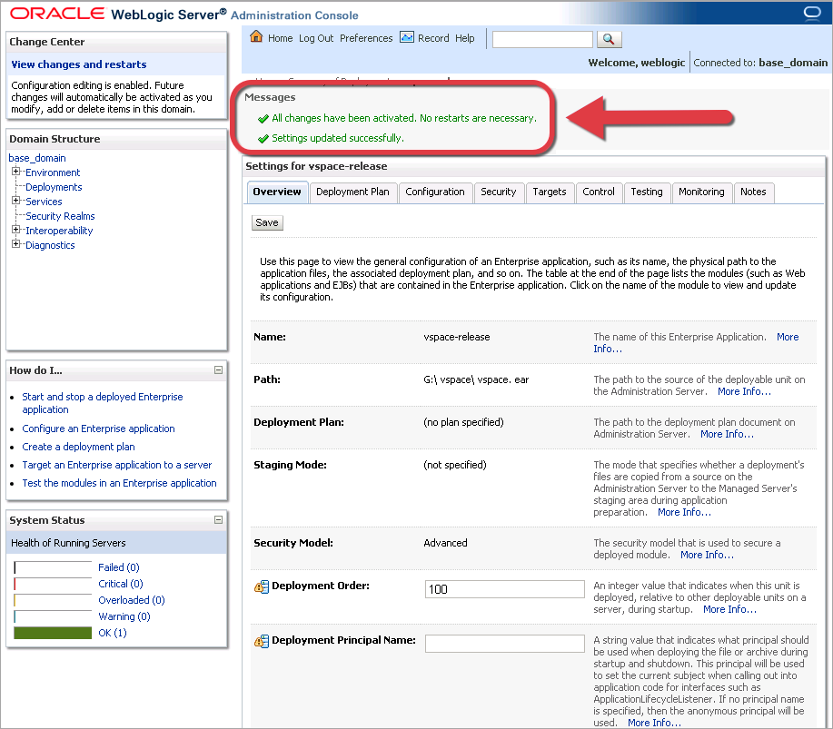
    
13. In the `Domain Structure` section, select `Deployments`.

14. Select your new Unity application name and click `Start`.

# Deploy the Application on JBoss	

The instructions in this section only apply if you're using an JBOSS application server. Note that Unity on JBOSS can’t connect to the FileNet that’s why FileNet searching or ICM will not work.

If you're using IBM WebSphere, see [Deploy the Application on WebSphere](#deploy-the-application-on-websphere).

If you’re using Oracle WebLogic, see [Deploy the Application on WebLogic](#deploy-the-application-on-weblogic).

## Datasources creation	

To create datasources for JBOSS:

1. Add required datasource sections to the `<JBOSS>/standalone/standalone-full.xml`:

    ```xml
    <subsystem xmlns="urn:jboss:domain:datasources:4.0">
       <datasources>
           <datasource jta="true" jndi-name="java:jboss/datasources/<PostgreSQL JNDI name>" pool-name="PostgresqlDS" enabled="true" use-java-context="true" use-ccm="true">
                        <connection-url>jdbc:postgresql://<PostgreSQL server>:<PostgreSQL port>/<DB name></connection-url>
                        <driver-class>org.postgresql.Driver</driver-class>
                        <driver>postgresql</driver>
                        <security>
                            <user-name><DB user></user-name>
                            <password><DB password></password>
                        </security>
           </datasource>
           <datasource jta="true" jndi-name="java:/<Oracle JNDI name>" pool-name="Oracle" enabled="true" use-java-context="true" use-ccm="true">
                        <connection-url>jdbc:oracle:thin:@//<Oracle server>:<Oracle port>/<DB name.domain></connection-url>
                        <driver-class>oracle.jdbc.driver.OracleDriver</driver-class>
                        <driver>oracle</driver>
                        <security>
                            <user-name><DB user></user-name>
                            <password><DB password></password>
                        </security>
                    </datasource>
                    <datasource jta="true" jndi-name="java:/<DB2 JNDI name>" pool-name="DB2" enabled="true" use-java-context="true" use-ccm="true">
                        <connection-url>jdbc:db2://<DB2 server>:<DB2 port>/<DB name></connection-url>
                        <driver-class>com.ibm.db2.jcc.DB2Driver</driver-class>
                        <driver>db2</driver>
                        <security>
                            <user-name><DB name></user-name>
                            <password><DB password></password>
                    </datasource>
                    <datasource jta="true" jndi-name="java:/<DB JNDI name>" pool-name="MSSQLDS" enabled="true" use-java-context="true" use-ccm="true"> 
                <connection-url>jdbc:sqlserver://<DB server>:<DB port>;databaseName=<DB name>;schema=<DB schema></connection-url>
                <driver-class>com.microsoft.sqlserver.jdbc.SQLServerDriver</driver-class>
                <driver>sqlserver</driver>
                <security>
                    <user-name><DB user></user-name>
                    <password><DB password></password>
                </security>
                <validation>               
                    <validate-on-match>false</validate-on-match>
                    <background-validation>false</background-validation>
                </validation>
                <statement>
                    <share-prepared-statements>false</share-prepared-statements>
                </statement>
            </datasource>
          </datasources>
          …………
             </subsystem>
        
    ```

2. Add driver sections to the `<JBOSS>/standalone/standalone-full.xml`:

    ```xml
    <subsystem xmlns="urn:jboss:domain:datasources:4.0">
              <datasources>
                    <drivers>
                        <driver name="h2" module="com.h2database.h2">
                            <xa-datasource-class>org.h2.jdbcx.JdbcDataSource</xa-datasource-class>
                        </driver>
                        <driver name="postgresql" module="org.postgresql">
                            <xa-datasource-class>org.postgresql.xa.PGXADataSource</xa-datasource-class>
                        </driver>
                        <driver name="oracle" module="com.oracle">
                            <driver-class>oracle.jdbc.driver.OracleDriver</driver-class>
                        </driver>
                        <driver name="db2" module="com.ibm.db2">
                            <driver-class>com.ibm.db2.jcc.DB2Driver</driver-class>
                        </driver>
                        <driver name="sqlserver" module="com.microsoft.sqlserver">   
                           <driver-class>com.microsoft.sqlserver.jdbc.SQLServerDriver</driver-class>                          </driver>
                    </drivers>
                </datasources>
            </subsystem>
    
    ```

3. Copy modules from `<Unity>/config/integration/appservers/jboss/modules` to the `<JBOSS>/modules`.

4. Copy driver jar files to the appropriate module folder:
    - `<JBOSS>/modules/com/ibm/db2/main`
    - `<JBOSS>/modules/com/Microsoft/sqlserver/main`
    - `<JBOSS>/modules/com/oracle/main`
    - `<JBOSS>/modules/org/postgresql/main`

## Install the application EAR file

To install Unity for JBOSS:

1. Add the following parameters to the `<JBOSS>/standalone/standalone-full.xml` file for the first time installation:

    ```xml
    <subsystem xmlns="urn:jboss:domain:security:1.2">
        <security-domains>
                    ……..
           <security-domain name="unity" cache-type="default">
               <authentication>
                   <login-module code="Remoting" flag="optional">
                       <module-option name="password-stacking" value="useFirstPass"/>
                   </login-module>
                   <login-module code="RealmDirect" flag="required">
                       <module-option name="password-stacking" value="useFirstPass"/>
                   </login-module>
               </authentication>
        </security-domain>
    …..
    </subsystem>
    ```
2. Add the following parameters to the `<JBOSS>/standalone/standalone-full.xml` file for the first time installation for FileNet connection:

    ```xml
    <subsystem xmlns="urn:jboss:domain:security:2.0">
        <security-domains>
            <security-domain name="FileNetP8WSI" cache-type="default">
                <authentication>
                    <login-module code="com.filenet.api.util.WSILoginModule" flag="required"/>
                </authentication>
    		……………..
            </security-domain>
        </security-domains>
    </subsystem>
    ```
3. Open the `vu.ear` file and edit the `Connection String for Case Manager`, `Configuration File Path` (`vu.ear/vu.war/WEB-INF/web.xml`) and the `Context Root`(`vu.ear/META-INF/application.xml`) values as needed. Default values are: 
   - Context-root = `vu`
   - Configuration file path = `file:///opt/vu/vega_unity.xml`
   - Connection String for Case Manager = `http://localhost:9080/CaseManager/`

4. Copy `vu.ear` file to the `<JBOSS>/standalone/deployments` folder.
	
# Confirm your installation	

Now that you've installed your Unity application, you can confirm the installation and open the application by navigating to one of the following links:

- `http://<ServerName>:9080/<context_root>/main.jsp` for WebSphere
- `http://<ServerName>:7011/<context_root>/main.jsp` for WebLogic
- `http://<ServerName>:8080/<context_root>/main.jsp` for JBOSS 

Enter your login and password at the login screen, and verify the Unity application opens, your configured tabs appear on the screen, and no documents appear on the tabs.

# Integrate Unity with Microsoft Office

The Microsoft Office plug-in for Unity creates a new Unity tab in Microsoft Word, Excel, Powerpoint and Outlook for users to import files directly from the application to Unity.

It also allows users to use the Open in Office and Check Out and Open actions in Unity in IE, Chrome, Firefox browsers.
	
## Install the plug-in	

To install the plug-in:

1. Make sure you already downloaded the vu zip archive file.

2. Open the following file path: `<VU>/VegaUnity/packages/OfficeIntegration/`

3. Unzip the `VU_Office_Integration.zip` file to a new folder.

4. Run the setup file.

5. On the Welcome screen, click `Next`:
 
    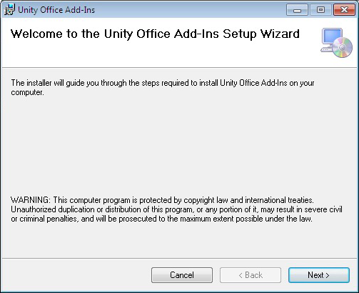

6. On the `Select Installation Folder` screen, enter the folder you just used to unzip the `VU_Office_Integration.zip` file and click `Next`:
 
    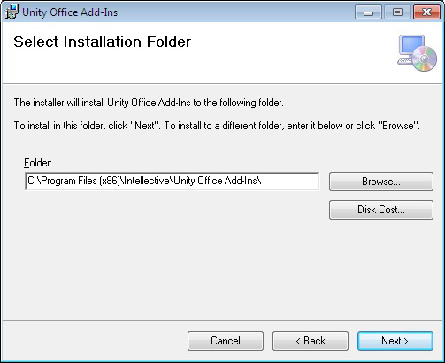
    
7. On the `Confirm Installation` window, click `Next`:
 
    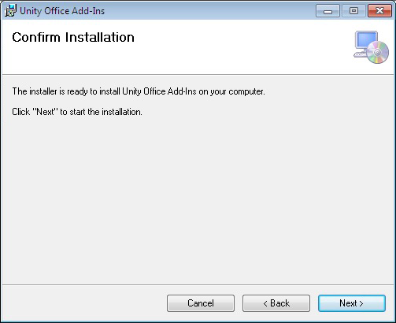
    
8. Click `Yes`:
 
    

9. On the `Installation Complete` click `Close`:
 
    

10. Restart Windows if the message `Please restart Windows after Installation` appears during installation, otherwise it should work right away.

11. Open Microsoft Office Word, Excel, PowerPoint, Outlook and check that toolbar contains a new Unity tab.

## ActiveX adjustment	

1. From the menu bar, select `Internet Options > Security > Trusted Sites`.

2. Click `Sites`.

3. Uncheck `Require server verification (https:) for all sites in this zone` and click `Add`.

## Remove the plug-in

To remove the plug-in:

1. Open `Control Panel` > `Programs` > `Uninstall a program`.

2. Select  `Unity Office Add-Ins`:
 
    
    
3. Click `Uninstall`, then click `Yes`:
 
    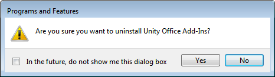
	
## Troubleshooting

1. UnityServerApp application.

    New UnityServerApp application was added to Office Integration Plug-In package. After installation, UnityServerApp is run in background and is listen for connections on a specific port (`http://locahost:27777`). It accepts jsonp request from Unity application, executes DLL function and sends back a response.
    After installation completed, following key will appear on user’s computer:      
    `SOFTWARE\Microsoft\Windows\CurrentVersion\Run\UnityServerApp`
     
    The exact path may depend on Windows version and can be found in System Configuration (`msconfig`):
 
    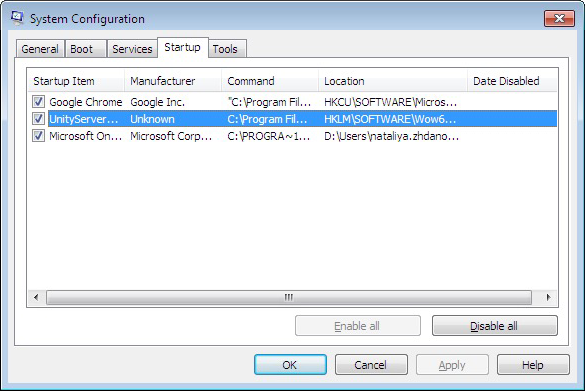
    
    This registry key has a path to `UnityServerApp.exe` as a value:
     
    
    
    It allows automatically start UnityServerApp on Windows startup. This application works in background:
     
    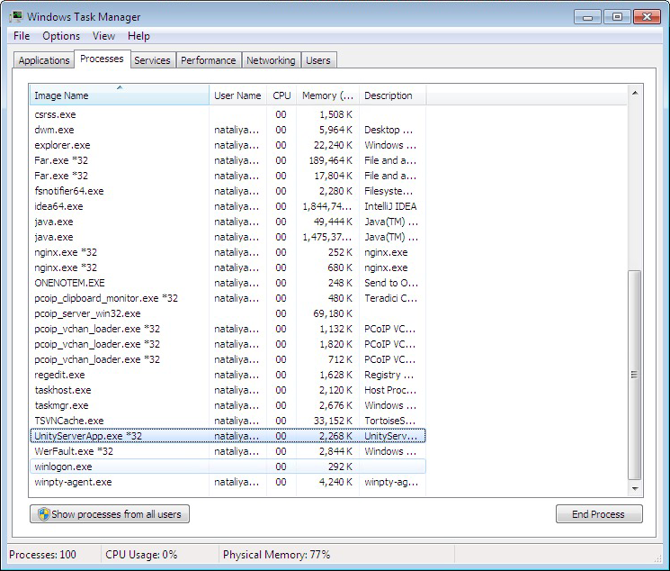
    
    For IE old algorithm is used (for backward-compatibility). It creates ActiveX object which allow to invoke functions inside DLL. If error happens on ActiveX object creation, new algorithm will be used.

2. Configure Unity tab in the Office application.

    a. Open `Office Application` > `File` > `Options`.
    
    b. Open `Add-ins` tab.

    c. In the bottom of Options pop-up in Manage drop-down select `COM Add-ins` and click `Go`:
 
      
    
    d. Make `Unity Add-in` enabled and click `OK`:
        
      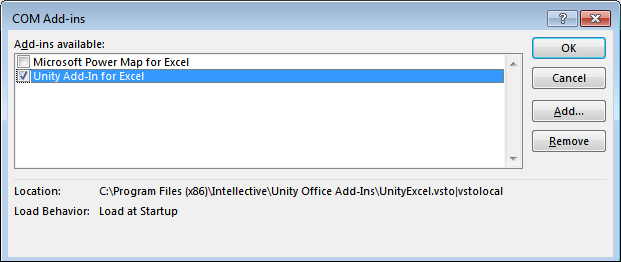
	
# Install the User Audit Module	

The User Audit module can be installed in the Unity application or as a standalone application.

## Integrate the User Audit Module with Unity	

If you already have a Unity application and want to integrate the User Audit module into it, you only need to set the appropriate configuration settings.

To integrate it with Unity:

1. Log into Unity and select the `Configuration Console` tab.

2. Expand the `Advanced Editor` section and select `global` for the Solution.

3. Expand the `Enterprise Solution > Configuration > User Audit` section.

4. Add the following snippet of code. Make sure to update the parameters as needed. All parameters are required.

    ```xml
    <?xml version="1.0" encoding="UTF-8"?>
    <Configuration>
    ......
           <UserAudit>       
               <AuditEnabled>true</AuditEnabled>
               <FilePath>/tmp/userlogin.csv</FilePath>
               <MaxFileSize>1024KB</MaxFileSize>       
               <LogPattern>sessionId;ip;username;date</LogPattern>
           </UserAudit>
    ......
    </Configuration>
    ```

5. Click `Apply` and then `Activate` to restart the application.

The parameters for the module include:

- `AuditEnabled` – this determines if the module is turned on. True means yes. False means no.
- `FilePath` – this is the path to the CSV statistics file that stores user audit information. This needs to be a valid path on the same machine as the Unity application.
- `MaxFileSize` – this determines how big the CSV statistics file can be before the system creates a new file.
- `LogPattern` – this determines the order of the data stored in the CSV statistics file. Possible values include `sessionId`, `ip`, `username`, and `date`.

## Install the User Audit Module as a standalone module

If you want to install the User Audit module as a standalone application using WebSphere and then deploy it to Unity, you need to integrate it with Unity as well as update Unity's `web.xml` file in WebSphere. 
This requires administrator access to the WAS console.

To install it as a standalone module:

1. Follow the steps in the previous section, [Integrate the User Audit Module with Unity](#integrate-the-user-audit-module-with-unity).

2. Stop the Unity application.

3. Copy the user audit module jar file to the following folder: `<VU>/VegaUnity/vspace.war/WEB-INF/lib`

4. Navigate to the following folder and open the `web.xml`: `<VU>/VegaUnity/vspace.war/WEB-INF/`

5. Add the following code to the root `web-app` section of the file:

    ```xml
    <filter>
                                    <filter-name>AuthLogFilter</filter-name>
                                    <filter-class>com.vegaecm.vspace.useraudit.AuthLogFilter</filter-class>
     </filter>
     
    <filter-mapping>
                                    <filter-name>AuthLogFilter</filter-name>
                                    <url-pattern>/</url-pattern>
     
     
    </filter-mapping>
    <filter-mapping>
                                    <filter-name>AuthLogFilter</filter-name>
                                    <url-pattern>*.jsp</url-pattern>
    </filter-mapping>
    <filter-mapping>
                                    <filter-name>AuthLogFilter</filter-name>
                                    <url-pattern>/services/*</url-pattern>
    </filter-mapping>
    <filter-mapping>
                                    <filter-name>AuthLogFilter</filter-name>
                                    <url-pattern>/servicesUT/*</url-pattern>
    </filter-mapping>
    <filter-mapping>
                                    <filter-name>AuthLogFilter</filter-name>
                                    <url-pattern>/downloadUT</url-pattern>
    </filter-mapping>
    <filter-mapping>
                                    <filter-name>AuthLogFilter</filter-name>
                                    <url-pattern>/DaejaGetContentLauncher</url-pattern>
    </filter-mapping>
    <filter-mapping>
                                    <filter-name>AuthLogFilter</filter-name>
                                    <url-pattern>/exportUT</url-pattern>
    </filter-mapping>
    <filter-mapping>
                                    <filter-name>AuthLogFilter</filter-name>
                                    <url-pattern>/view</url-pattern>
    </filter-mapping>
    <filter-mapping>
                                    <filter-name>AuthLogFilter</filter-name>
                                    <url-pattern>/viewUT</url-pattern>
    </filter-mapping>
    <filter-mapping>
                                    <filter-name>AuthLogFilter</filter-name>
                                    <url-pattern>/admin</url-pattern>
    </filter-mapping>
    <filter-mapping>
                                    <filter-name>AuthLogFilter</filter-name>
                                    <url-pattern>/adminUT</url-pattern>
    </filter-mapping>
    <filter-mapping>
                                    <filter-name>AuthLogFilter</filter-name>
                                    <url-pattern>/ut/*</url-pattern>
    </filter-mapping>
    ```

6. Open the WAS administrative console at the following path:

    `http://<ServerName>:9060/ibm/console` where `<ServerName>` is the name of your server.

7. Log into the system.

8. From the left navigation, expand `Application > Application Types`, then select `WebSphere enterprise applications`.

9. Select your Unity application and click `Update`:

    

10. Select `Replace or add a single file`.

11. Specify the relative path to the `web.xml` file.

12. Click Choose File and select the updated `web.xml` file:
 
    

13. Save your changes and start the application.
	
# UCM configuration	

## JBPM configuration

### External database	

Out of the box, jBPM application uses embedded H2 database to store process and case data.
The UCM requires that the standalone database should be used by jBPM application instead of embedded one. The initial UCM release supports Microsoft SQL Server 2012 database. Unity 7.2.1 Release added support for PostgreSQL database.

The following steps are actual for jBPM 7.6.0 Final.
These steps modify the OOTB jBPM application installation package to have jBPM application installed and configured to use the standalone Microsoft SQL Server 2012 database.

1. Place `<VegaUnity build>\config\integration\jbpm\db\sqlserver_module.xml` to `<jbpm-installer>\db` folder.

2. Place `sqljdbc.jar` to `<jbpm-installer>\db\drivers` folder.

3. Create dedicated jBPM database  at Microsoft SQL Server 2012 server using the following script `<jbpm-installer>\db\ddl-scripts\sqlserver\sqlserver-jbpm-schema.sql`.

4. Change `<jbpm-installer>\build.properties` file.

    a. Comment out H2 related lines:
    
        ```xml
        # H2.version=1.3.168
        # db.name=h2
        # db.driver.jar.name=h2-${H2.version}.jar
        # db.driver.download.url=http://repo1.maven.org/maven2/com/h2database/h2/${H2.version}/h2-${H2.version}.jar
        ```
    
    b. Add MSSQL2012 related lines:
    
        ```xml
        db.name=sqlserver
        db.driver.module.prefix=com/sqlserver
        db.driver.jar.name=sqljdbc4.jar
        org.kie.server.persistence.dialect=org.hibernate.dialect.SQLServer2012Dialect
        ```
    
        Or PostgreSQL related lines:
        
        ```xml
        #postgresql
        db.name=postgresql
        db.driver.module.prefix=org/postgresql
        db.driver.jar.name=postgresql-42.2.2.jar
        org.kie.server.persistence.dialect=org.hibernate.dialect.PostgreSQLDialect
        ```
    
        | **Note**: Please check that the above lines do not contain space character(s) at the end of each line.

5. Change `<jbpm-installer>\build.xml` file.

    a. Change the value of `jboss.bind.address` property from `localhost` to `0.0.0.0`.
    
    b. Uncomment `<arg value="-Dorg.kie.server.persistence.dialect=${org.kie.server.persistence.dialect}" />` line at `<exec executable="${jboss.full.path.win}" spawn="yes" osfamily="windows">` section.

6. Change `<jbpm-installer>\ standalone-full-wildfly-10.1.0.Final.xml` file.

    a. Comment out H2 jbmDS datasource:
    
        ```xml
        <datasource jta="true" jndi-name="java:jboss/datasources/jbpmDS" pool-name="H2DS" enabled="true" use-java-context="true" use-ccm="true">
                            <connection-url>jdbc:h2:tcp://localhost/~/jbpm-db;MVCC=TRUE</connection-url>
                            <driver>h2</driver>
                            <security>
                                <user-name>sa</user-name>
                            </security>
                        </datasource>
        ```
      
    b. Add MSSQL2012 jbpmDS datasource (`<subsystem xmlns="urn:jboss:domain:datasources:4.0">` section):
    
        ```xml
        <datasource jta="true" jndi-name="java:jboss/datasources/jbpmDS" pool-name="MSSQLDS" enabled="true" use-java-context="true" use-ccm="true"> 
                    <connection-url>jdbc:sqlserver://<DB server>:<DB port>;databaseName=<DB name>;schema=<DB schema></connection-url>
                    <driver-class>com.microsoft.sqlserver.jdbc.SQLServerDriver</driver-class>
                    <driver>sqlserver</driver>
                    <security>
                        <user-name><DB user></user-name>
                        <password><DB password></password>
                    </security>
                    <validation>               
                        <validate-on-match>false</validate-on-match>
                        <background-validation>false</background-validation>
                    </validation>
                    <statement>
                        <share-prepared-statements>false</share-prepared-statements>
                    </statement>
                </datasource>
        
        ```

    c. Add sql driver section:
        
        ```xml
        <drivers>
                            ……….
                            <driver name="sqlserver" module="com.sqlserver">   
                                <xa-datasource-class>com.microsoft.sqlserver.jdbc.SQLServerXADataSource</xa-datasource-class>
                            </driver>
                        </drivers>
        ```
      
        Or add PostgreSQL datasource (`<subsystem xmlns="urn:jboss:domain:datasources:4.0">` section):
        
        ```xml
        <datasource jta="true" jndi-name="java:jboss/datasources/jbpmDS" pool-name="PostgresqlDS" enabled="true" use-java-context="true" use-ccm="true">
                            <connection-url>jdbc:postgresql://<DB server>:<DB port>/<DB name></connection-url>
                            <driver-class>org.postgresql.Driver</driver-class>
                            <driver>postgresql</driver>
                            <security>
                                <user-name><DB user></user-name>
                                <password><DB password></password>
                            </security>
                        </datasource>
        ```
     
        And PostgreSQL driver:
        
        ```xml
        <driver name="postgresql" module="org.postgresql">
                                <xa-datasource-class>org.postgresql.xa.PGXADataSource</xa-datasource-class>
                            </driver>
        ```

7. Change `<jbpm-installer>/lib/kie-server-7.6.0.Final-wildfly-10.1.0.Final.war/WEB-INF/lib/kie-server-services-jbpm-7.6.0.Final.jar/ jpa/META-INF/persistence.xml`.

    a. Comment out H2 related lines:
    
        ```xml
        <property name="hibernate.dialect" value="org.hibernate.dialect.H2Dialect" />
        <property name="hibernate.hbm2ddl.auto" value="update" />
        ```
    
    b. Add MSSQL2012 dialect lines:
    
        ```xml
        <property name="hibernate.dialect" value="org.hibernate.dialect.SQLServer2012Dialect" />
        <property name="hibernate.hbm2ddl.auto" value="none" />     
              <property name="javax.persistence.schema-generation.database.action" value="none" />
              <property name="javax.persistence.schema-generation.scripts.action" value="none" />
        ```
    
    c. For PostgreSQL:
    
        ```xml
        <property name="hibernate.dialect" value="org.hibernate.dialect.PostgreSQLDialect" />
        <property name="hibernate.hbm2ddl.auto" value="none" />     
              <property name="javax.persistence.schema-generation.database.action" value="none" />
              <property name="javax.persistence.schema-generation.scripts.action" value="none" />
        ```
	
## UCM database changing

Execute the following script for UCM database or create a separate DB (jdbc/ucm datasource should be configured for it): 

`<Unity build>\VegaUnity\config\database\ucm\sqlserver`

- `createUcmSchema.MSSQL.sql` – for separate database
- `updateJbpmSchema.MSSQL.sql` – for JBPM database
	
### Datasources configuration	

The following items should be configured at application server when using jBPM platform:

- jBPM database data source 
 
   JNDI name: `jdbc/ucm-jbpm`. This is the actual jBPM application database. The database is used by Unity Case/Work Items query service search.

- Documents links / annotations data source  
 
   JNDI name: `jdbc/ucm`. The UCM stores the document links (for some of document link strategies) and annotations here.

Two above data sources can point to the same jBPM database if this database also holds UCM document links and annotations. 

Alternatively, the database layout can include two separate databases: 

- jBPM database (patched with UCM SQL DDL scripts in order to enable UCM query service for cases/work items/tasks)
- UCM database (UCM document links and annotations) 
 
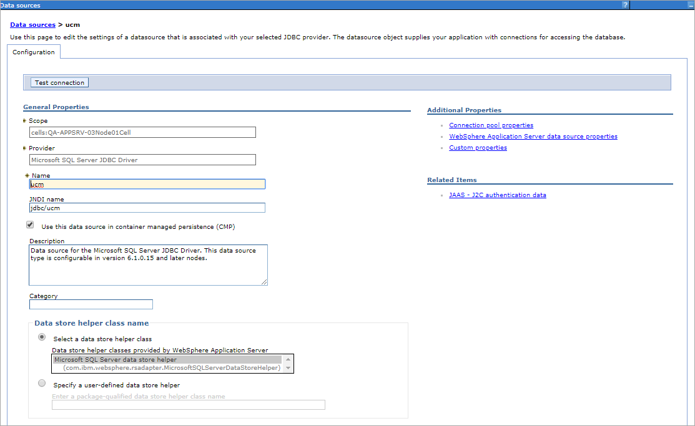

## Login module configuration

The UCM login module allows to establish trusted relationship between Unity application deployed at one application server and jBPM application deployed at different Wild Fly application server. 

So, if the user has been authenticated at Unity application then this user can make REST API calls to jBPM application using this authentication

### JBPM server configuration

1. Put the following files into the `%wildfly_home%/modules/system/layers/base/com/vegaecm/ucm/login/main` folder:

    - `<VegaUnity build>\config\integration\jbpm\wildfly\modules\system\layers\base\com\vegaecm\ucm\login\main\module.xml`
    - `<VegaUnity build>\config\integration\jbpm\wildfly\modules\system\layers\base\com\vegaecm\ucm\login\main\vu-ucm-wf-security-7.2.0.1.jar`
    
2. Update the `%wildfly_home%/standalone/configuration/standalone-full.xml` file (that is referenced from `%jbpm_home%/build.xml` as `<arg value="--server-config=standalone-full.xml" />`). Add `com.vegaecm.ucm.login` global module: 

    ```xml
    <subsystem xmlns="urn:jboss:domain:ee:4.0">
                 <!-- UCM Login Module -->
            <global-modules>
                <module name="com.vegaecm.ucm.login" slot="main"/>
            </global-modules>
        </subsystem>
    
    
    <subsystem xmlns="urn:jboss:domain:security:1.2">
                <security-domains>
    …………
                    <security-domain name="other" cache-type="default">
                        <!-- Domain keystore configuration (key store used by the UCM Login Module) -->
                <jsse truststore-password="_default_ucm_ks_pwd" truststore-type="jceks" truststore-url="${jboss.server.config.dir}/ucmKeyStoreJBPM.jceks"/>
                        <authentication>
                <!-- BEGIN : UCM Login Module -->
                <login-module code="com.vegaecm.vu.ucm.wildfly.security.TrustedUserLoginModule" flag="optional">
                    <module-option name="securityDomain" value="other"/>
                    <module-option name="alias" value="ucmUserIdentity"/>                       
                    <module-option name="aliasKey" value="_default_ucm_alias_pwd"/>
                    <module-option name="assignRoles" value="rest-all"/>
                    <module-option name="password-stacking" value="useFirstPass"/>
                </login-module>
                <!-- END :UCM Login Module -->
    ………..
            </security-domains>
    ……..
    </subsystem>
    ```

3. Place UCM key store file (`ucmKeyStoreJBPM.jceks`) into `%wildfly_home%/standalone/configuration` folder. 

   This file can be taken from the `<VegaUnity build>\config\integration\jbpm\wildfly` folder of the Unity distribution package.
	
### WebSphere configuration	

The Unity web application configuration has been extended with three new UCM specific environment entries:
- `ucmKeyStorePath` – the filesystem path to the Unity UCM key store that contains `ucmUserIdentity` public key alias used to encrypt communication between Unity and jBPM server (the jBPM application server – WildFly – should also have jBPM UCM key store that contains private key that corresponds to the public key above), default public key is stored in the `<VegaUnity build>\config\integration\appservers\was\ucmKeyStoreWAS.jceks`
- `ucmKeyStoreKey` – the UCM key store password (default value: `_default_ucm_ks_pwd`)
- `ucmKeyAliasKey` – the `ucmUserIdentity` alias password (default value: `_default_ucm_alias_pwd`)
 


### WebLogic or JBoss configuration

The following sections should be updated in the `vu.ear/vu.war/WEB-INF/web.xml` file:

```xml
<env-entry>
       <env-entry-name>ucmKeyStorePath</env-entry-name>
       <env-entry-type>java.lang.String</env-entry-type>
       <env-entry-value>file:///<path>/ucmKeyStoreWAS.jceks</env-entry-value>
    </env-entry>

    <!-- UCM Key store password reference -->
    <env-entry>
       <env-entry-name>ucmKeyStoreKey</env-entry-name>
       <env-entry-type>java.lang.String</env-entry-type>
       <env-entry-value><password></env-entry-value>
    </env-entry>

    <!-- UCM User Identity alias password reference -->
    <env-entry>
       <env-entry-name>ucmKeyAliasKey</env-entry-name>
       <env-entry-type>java.lang.String</env-entry-type>
       <env-entry-value><alias password></env-entry-value>
    </env-entry>
```
	
### Public key generation	

There two different UCM keystores that provide the secure communication between Unity UCM code and jBPM REST API services. 
The first key store is deployed at Unity application server (for example IBM Web Sphere) and contains public key that is used to encrypt user credentials when calling the jBPM REST API services. 
The second key store is deployed at application server of jBPM application (WildFly 10) and contains the private key that allows to decrypt the user credentials at incoming Unity calls.

The typical sequence to generate the above key stores includes the following steps:

1.	(Oracle Java 8) generate public/private key pair.
2.	(Oracle Java 8) export public key certificate from step #1.
3.	(WAS 8.5.5 IBM Java 7) import public key from step #2.

#### JBPM Public key generation

File name: ucmKeyStoreJBPM.jceks  
Store type: JCEKS  
Key algorithm: RSA  
Key size: 2048  
Key alias: ucmUserIdentity  

The mandatory objective of this key store is to hold the private key that allows to decrypt the user credentials at incoming Unity calls.

The standard keytool application of Oracle JRE can be used to create JBPM UCM key store.

```xml
@rem Set the Java version that will be used for key store generation

@rem !!! Should the the same Java as have used for jBPM application server

@set JAVA_HOME=D:\Programs\varJDKs\jdk1.8.0_111

@rem Generate public/private key pair (alias = ucmUserIdentity)

@rem and place it to the newly created key store

@"%JAVA_HOME%\bin\keytool" -genkeypair -storetype jceks -keystore ucmKeyStoreJBPM.jceks -alias ucmUserIdentity -keyalg RSA -keysize 2048 -dname "cn=Eugene Smirnov, ou=Engineering, o=Intellective, c=CA" -keypass _default_ucm_alias_pwd -storepass _default_ucm_ks_pwd -startdate 2018/03/31 -validity 10000 -v

@rem List the content of the newly created key store (read only access, for reference only)

@"%JAVA_HOME%\bin\keytool" -list -storetype jceks -keystore ucmKeyStoreJBPM.jceks -storepass _default_ucm_ks_pwd
```

#### Unity Public key generation

File name: ucmKeyStoreWAS.jceks  
Store type: JCEKS  
Key algorithm: RSA  
Key size: 2048  
Key alias: ucmUserIdentity  

The mandatory objective of this key store is to hold the public key that is used to encrypt user credentials when calling the jBPM REST API services.

The standard keytool application of Oracle JRE can be used to create Unity UCM key store.

- Step 1. Export public key certificate from jBPM UCM keystore to `ucmPubKey.cert` file:
    
    ```xml
    @rem Set the Java version that was used for jBPM UCM key store generation
    
    @rem !!! Should the the same Java as have used for jBPM application server
    
    @set JAVA_HOME=D:\Programs\varJDKs\jdk1.8.0_111
    
    @rem Export public key certificate into ucmPubKey.cert file
    
    @"%JAVA_HOME%\bin\keytool" -export -storetype jceks -keystore ucmKeyStoreJBPM.jceks -alias ucmUserIdentity -keypass _default_ucm_alias_pwd -storepass _default_ucm_ks_pwd -v -rfc -file ucmPubKey.cert
    ```

- Step 2. Create new `ucmKeyStoreWAS.jceks` key store and import the public key from `ucmPubKey.cert` certificate file:
    
    ```xml
    @rem Set the Java version that will be used for Unity UCM key store generation
    
    @rem !!! Should the the same Java as have used for Unity application server
    
    @rem (IBM JRE for IBM Web Sphere)
    
    @set JAVA_HOME=D:\Programs\varJDKs\V8.5.5.11\java_1.7_64
    
    @rem Create new key store and import public key from ucmPubKey.cert certificate file
    
    @"%JAVA_HOME%\bin\keytool" -import -storetype jceks -keystore ucmKeyStoreWAS.jceks -alias ucmUserIdentity -keypass _default_ucm_alias_pwd -storepass _default_ucm_ks_pwd -v -file ucmPubKey.cert
    
    @rem List the content of the newly created key store (read only access, for reference only)
    
    @"%JAVA_HOME%\bin\keytool" -list -storetype jceks -keystore ucmKeyStoreWAS.jceks -storepass _default_ucm_ks_pwd
    ```

## UCM ICM configuration	

ICM installation does not require specific actions, besides the following sections update in the `vu.ear/vu.war/WEB-INF/web.xml` file:

```xml
<context-param>
       <param-name>spring.profiles.active</param-name>
       <param-value>icm</param-value>
    </context-param>
```

# Configuration Console: Search Users and Groups in LDAP

If you want to integrate the LDAP search into Configuration Console, you only need to set the appropriate configuration settings. 

1. Log into Unity and select the `Configuration Console` tab. 

2. Expand the `Advanced Editor` section and select `global` for the Solution. 

3. Expand the `Enterprise Solution` and right click on the `Configuration`.

4. Pick `Add Section`. 

5. Add the following snippet of code. Make sure to update the parameters as needed. All parameters except for `CountLimit` are required. 

```xml
<LDAP>
	<Uri>ldap://192.168.210.58</Uri>
	<Container>CN=Users,DC=imsol1,DC=dom</Container>
	<GroupFilter>(objectclass=group)</GroupFilter>
	<UserFilter>(objectclass=person)</UserFilter>
	<NameAttribute>cn</NameAttribute>
	<SearchScope>SUBTREE_SCOPE</SearchScope>
	<CountLimit>100</CountLimit>
	<Username>username</Username>
	<Password>password</Password>
</LDAP>
```

6. Click `Apply` and then `Activate` to restart the application. 

The parameters for the module include: 

|Parameter|Description|
|:--------|:----------|
|URI | LDAP provider URL|
|Container | The name of the context or object to search| 
|GroupFilter | The filter expression to use for the group search| 
|UserFilter | The filter expression to use for the user search| 
|NameAttribute | Attribute to be returned (group or user name)| 
|SearchScope | The search scope. Available options are `OBJECT_SCOPE`, `ONELEVEL_SCOPE`, `SUBTREE_SCOPE`| 
|CountLimit | The maximum number of entries that will be returned. Default is 0 – no limit|
|Username | Security principal| 
|Password | Security credentials. Can be encrypted with 3DES|

# Alfresco CMIS HTTP/HTTPS

Port 443 and the HTTPS protocol settings must be enabled in `alfresco-global.properties` in Alfresco and Share. 
This is because if a proxy is serving https, and then proxying back to Tomcat using http, Tomcat determines that HTTP traffic is being served. 
This in turn informs the applications running in Tomcat that they are serving traffic over HTTP, 
and when Share or Alfresco internally generate URLs for page assets, they are generated with an http link (when the client browser expects https). 

Setting these properties:

    alfresco.port=443
    alfresco.protocol=https
    share.port=443
    share.protocol=https 

ensures that the applications generate URLs as HTTPS links.