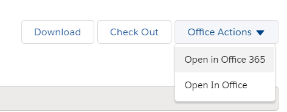

# Description

*content to be added*

## Toolbar

Toolbar on `Document Properties` tab may contain one of following actions:

- `checkout`

- `cancel checkout`

- `checkin`

- `view content`. This action opens document content in a new tab or downloads the document depending on it's content type. 
    Action will be hidden if one of `open in office` actions is available for the document.

- `download`

- `open in browser`. Action is only available for SharePoint office documents and opens the document in Office 365.

- `open in desktop app`. Action is only available for SharePoint office documents and opens the document in 
Office Desktop App.

    `open in browser`, `open in destop app` actions are automatically grouped into `Office Actions` dropdown:

    

*other actions to be added*

- `delete`

For listed above actions to appear on the toolbar:
 
- They should be added to the view in solution configuration file. 
See [How To Add Action To The View](../../configuration/tags-list/views-tag/tab-action-set.md) for details on toolbar 
configuration.

- User should have enough rights to perform the action and action itself has to be available for the document.

- None of the described above specific hiding rules are applied. 

## Document properties

*content to be added*