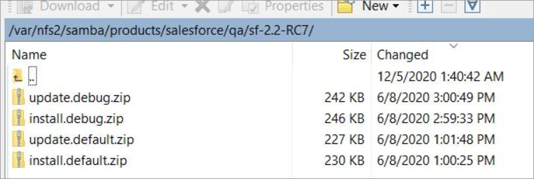
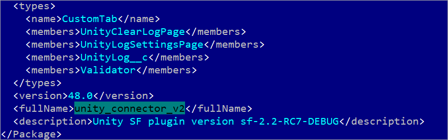
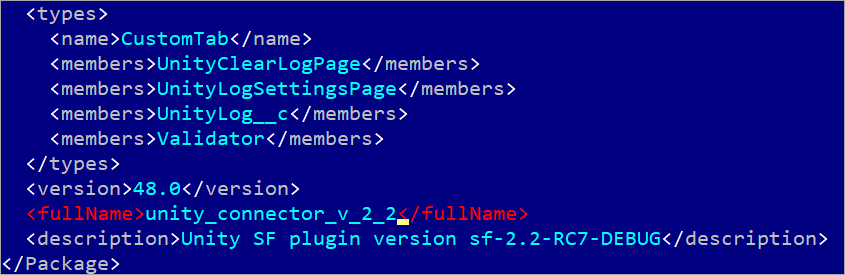
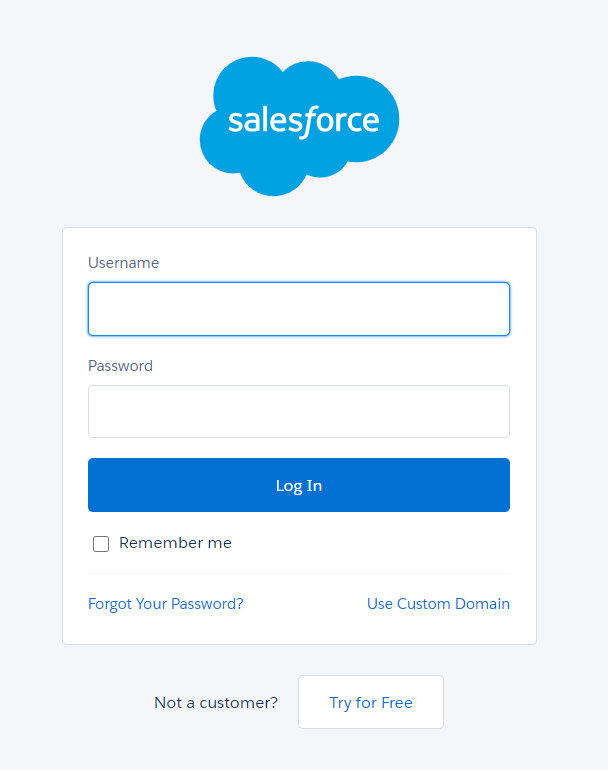
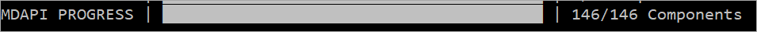
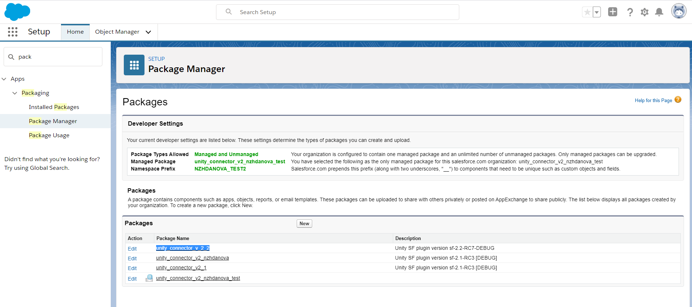
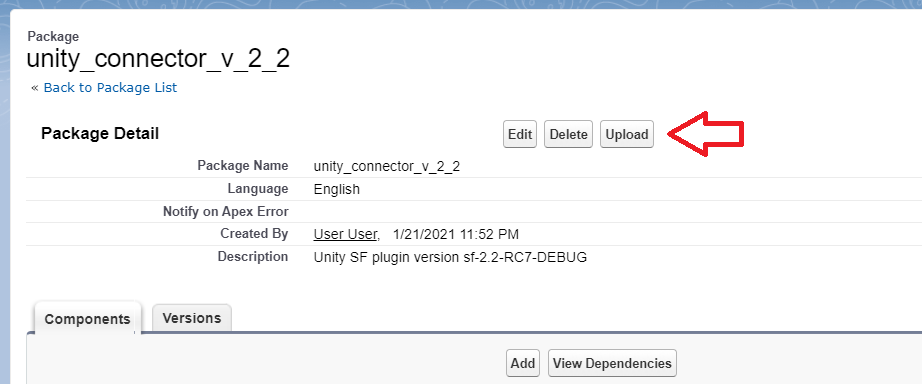
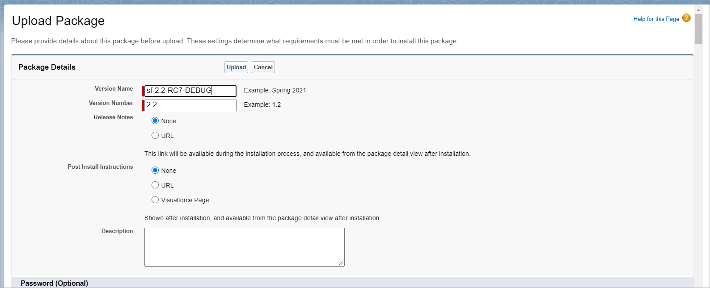
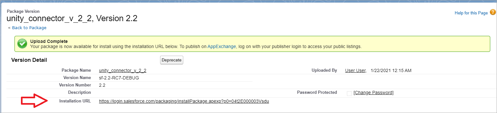

# Prerequisites

- Salesforce account should exist or has to be created for managed package
- Salesforce CLI should be installed in order to deploy a package to Salesforce Org

# Deploy a Package to Salesforce Org

- Download a package using WinSCP (or any other tool) from 192.168.110.17 
(`/var/nfs2/samba/products/salesforce/qa/sf-{PACKAGE-VERSION}`):

    

	| Package name       | Terms of use          |
	|:-------------------|:------------------------------------------|
	| install.default.zip| Default version of package created for QA testing. Should be used for initial installation |
	| update.default.zip | Default version of package created for QA testing. Should be used when upgrading previously installed `default` version |
	| install.debug.zip  | Debug version of package with additional debug capabilities. For internal use and customers' Org troubleshooting. Should be used for initial installation |
	| update.debug.zip   | Debug version of package with additional debug capabilities. For internal use and customers' Org troubleshooting. Should be used when upgrading previously installed `debug` version |
	
- Unzip the archive

- Open `mdapi_output` folder inside unzipped archive in Far Manager

    Package name is `unity_connector_v2` by default and can be changed in `package.xml` file:
    
    
    
    When upgrading use the name of existing package.
    
    When creating new one just leave as is or modify, e.g.:
    
     
     
    Remember this name as it will be used in further steps.

- **Skip this step if you don't need to create a managed package** (i.e. if you only need to deploy package for testing)
    
    Remove the following folders: 
    - authproviders
    - namedCredentials 
    - customMetadata  

- **Skip this step if you don't need to create a managed package** (i.e. if you only need to deploy package for testing) 

    Open `package.xml` file once again and remove following sections:

    ```xml
      <types>
        <name>AuthProvider</name>
        <members>UnityOAuth2Provider</members>
      </types>
    ```
    
    ```xml
      <types>
        <name>NamedCredential</name>
        <members>vu_nc</members>
      </types>
    ```
    
    ```xml
      <types>
        <name>CustomMetadata</name>
        <members>UnityOAuth2Setting__mdt.UnityOAuth2Provider</members>
      </types>
    ```

- Enter following command in a command prompt from `mdapi_output` folder:

    ```text
    sfdx force:auth:web:login --setdefaultdevhubusername
    ```

- Salesforce login page will be opened in a new browser tab:

    
 
- Enter your credentials and click `Log In`

- Enter following command from **root** archive folder:

    ```text
    sfdx force:mdapi:deploy -d mdapi_output/ -u "nzhdanova@intellective.com" -w 1
    ``` 

    Replace `nzhdanova@intellective.com` with your username. 

- Press `Ctrl+O` and ensure all components were successfully updated:

    

    Notes: 
    - number of components may be different and depends on package version 
    - MDAPI progress may have a different view, it depends on Salesforce CLI version
    - it's possible to check job progress by given Job ID, see Salesforce CLI guide for more details on available commands
    
# Create Managed Package
    
- Open Salesforce Org and find deployed package (`Gear icon` > `Setup` > `Package Manager`):

    
    
- Open package from the list and click `Upload` button:

    

- Enter upload details (`Version Name` and `Version Number`), e.g.:

    
    
- Click `Upload` button. Upload process will be started:

    
    
- After process is finished, `Installation URL` will become available (`https://login.salesforce.com/packaging/installPackage.apexp?p0=04t2E000003Vsdu`):

    

- Wait for about 5-30 minutes before installing it to another Org.