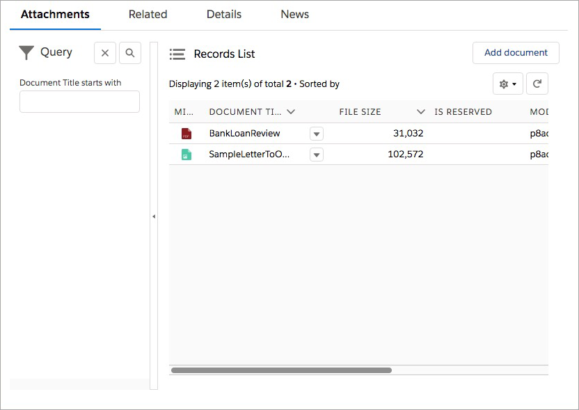
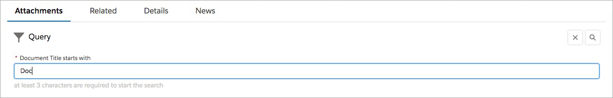
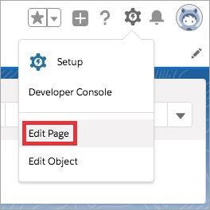

# Available Global Components

We have 4 global components implemented:
-	Unity Search Template
-	Unity Details Page
-	Unity Criteria Panel
-	Unity Grid View

Unity Criteria Panel and Unity Grid View are implemented and work fine but should be used inside the same container. 
When placed inside different containers, asynchronous data loading may cause some problems. 
So, in most cases it’s better to use Unity Search Template component or put related Unity Criteria Panel and Grid View to the same container. 

## Unity Search Template

This component contains query panel and grid with actions. Can be linked with any search template configured in Unity configuration file.


 
Component configuration:

|Parameter|Description|Example|
|:--------|:----------|:------|
|Configuration link | Search Template’s relative configuration link. It has following structure: `api/{API_VERSION}/config/templates/{SEARCH_TEMPLATE_ID}`. Either Configuration link or Search template should be specified | api/1.0.0/config/templates/global_Salesforce|
|Action Reference Id | Code to link related Unity Details Page component | open_ref|
|Search Template (if no configuration link) | If no configuration link provided, search template should be selected from dropdown. Selector contains only search templates which are parts of tabs according to configuration | Attached Documents|
|Height (pixels) | Height of Search Template container in pixels | 500|

If Unity Search Template component is used in non-console application, it’s not possible to open document/case/workitem properties in a separate tab, so Unity Details Page should be added to page layout and linked with Unity Search Template. 
Unity Details Page’s Reference Id and Unity Search Template’s Action Reference Id should match.

## Unity Details Page

This component can be used in non-console application to open and edit document/case/workitem properties.


 
Component configuration:

|Parameter|Description|Example|
|:--------|:----------|:------|
|Reference Id |Code to link related Search Template or Grid View components | open_ref|

It’s possible to link one Unity Details Page component with several Unity Grid View and/or Unity Search Template components. One-to-one relation is also supported.

## Unity Criteria Panel

This component contains set of criterions used to restrict search results. It can be linked with one or many Unity Grid View components. 

Unity Criteria Panel is linked to defined in Unity configuration file Search Template. Unity Grid View is also linked with some Search Template. 
Here is an example for one-to-many relation:

|Component Name|Linked Search Template ID|Reference Id / Search Reference Id|Description|
|:-------------|:------------------------|:-------------------------------|:----------|
|Unity Criteria Panel | `FileNet_Search` | `search_ref` | `FileNet_Search` should have at least one criterion. Property can be added as a criterion to `FileNet_Search` only if it can be added to `CMISAlfresco_Search` and `Box_Search` search templates|
|Unity Grid View |`FileNet_Search` | `search_ref` | `FileNet_Search` should have at least one criterion. Property can be added as a criterion to `FileNet_Search` only if it can be added to `CMISAlfresco_Search` and `Box_Search` search templates|
|Unity Grid View | `CMISAlfresco_Search` | `search_ref` | `CMISAlfresco_Search`’s criteria section can be empty or contain criterions|
|Unity Grid View | `Box_Search` | `search_ref` | `Box_Search`’s criteria section can be empty or contain criterions|

In this particular case we may use one query panel to search in different repositories using the same criteria, e.g. `Document Title starts with`: 


 
Component configuration:

|Parameter|Description|Example|
|:--------|:----------|:------|
|Configuration link | Search Template’s relative configuration link. It has following structure: `api/{API_VERSION}/config/templates/{SEARCH_TEMPLATE_ID}`. Either Configuration link or Search template should be specified | api/1.0.0/config/templates/FileNet_Search|
|Reference Id | Code to link related Unity Grid View components | search_ref|
|Search Template (if no configuration link) | If no configuration link provided, search template should be selected from dropdown. Selector contains only search templates which are parts of tabs according to configuration | FileNet Search|
|Height (pixels) | Height of Query Panel container in pixels. If height equals 0, than auto-height will be used | 0|
|Auto-execute | Execute search after component loaded | true|

## Unity Grid View

This component contains search results and action toolbar. It can be linked with Unity Criteria Panel and Unity Details Page.


 
Component configuration:
 
|Parameter|Description|Example|
|:--------|:----------|:------|
|Configuration link	| Search Template’s relative configuration link. It has following structure: `api/{API_VERSION}/config/templates/{SEARCH_TEMPLATE_ID}`. Either Configuration link or Search template should be specified	| api/1.0.0/config/templates/FileNet_Search|
|Search Reference Id | Code to link related Unity Criteria Panel component | search_ref|
|Action Reference Id | Code to link related Unity Details Page component | open_ref|
|Search Template (if no configuration link) | If no configuration link provided, search template should be selected from dropdown. Selector contains only search templates which are parts of tabs according to configuration | FileNet Search|
|Height (pixels) | Height of Grid View container in pixels | 500|
|Auto-execute | Execute search after component loaded | true|

# Add Global Components on Page Layout

In order to add global components to SF Object page layout:

1.	Open Application (Sales, Sales Console, etc.).

2.	Open SF Object (Account / Opportunity or whatever).

3.	Click on `Setup` button and then select `Edit Page`:
    
    
 
4.	On the left side of a page there will be section with Custom components:

    
 
5.	DnD needed components to page layout.

6.	Click on each added component and define component configuration (it will appear on the right side of a page):

    
 
7.	Click on `Activation…` button and assign Record Page as `App Default` for Sales, Sales Console or whatever application from Step 1:

    
 
8.	Click on `Save` button.

# Unity Configuration

## Bind Data to Standard SF Objects

It’s possible to bind uploaded documents or created cases/workitems to certain SF objects like Accounts, Opportunities, etc.
In this case we’ll need to add extra fields to search template and document/case/workitem view:

1.	Open Application (Sales, Sales Console, etc).

2.	Open SF Object (Account / Opportunity or whatever).

3.	Click on `Setup` button and then select `Edit Object`.
 
4.	Select `Fields and Relationships` section.

5.	Find fields you need to use in order to bind uploaded documents / created cases / workitems. Copy their `Field Name`. 

6.	Add properties with name `External.{FIELD_NAME}` to configuration file. E.g. for Account’s `Account Name` field following property should be added:     
    
    ```xml
    <Property ID="External.Name">
        <Name>Account Name</Name>
        <Type>string</Type>
        <Resizable>true</Resizable>
        <Sortable>true</Sortable>
        <MultiValue>false</MultiValue>
        <XType/>
        <Tooltip/>
    </Property>
    ```
    
    Few properties may be used to link data, e.g. `Account Name` and `Account Number`.

7.	Map properties from Step 6 to Document/Case or Workitem properties (RepositoryDataProvider -> PropertyNameMapper). E.g.
    
    ```xml
    <Mapping external="External.Name" internal="TextSF"/>
    ```
    
8.	Add hidden criteria to appropriate Search Template, e.g.:
    
    ```xml
    <Criterion>
        <FieldName>External.Name</FieldName>
        <Type>string</Type>
        <Operator>eq</Operator>
        <Required>false</Required>
        <Hidden>true</Hidden>
        <Readonly>true</Readonly>
        <MultiValue>false</MultiValue>
    </Criterion>
    ```

9.	Add external fields to appropriate fieldset in solution configuration, e.g.:
    
    ```xml
    <Field ID="External.Name" Label="Account Name" Required="true" Hidden="true" Row="1" Column="1" Favorite = "true"/>
    ```
