# Planning Unity for Salesforce Installation

## Review prerequisites

- A new account should be created in the Salesforce Org where UnityApp will be installed
- Link to install UnityApp in the Salesforce Org
- Unity application should be installed and available external to the organization using HTTPS protocol
- Unity application should be configured with at least one search template to search documents in FileNet P8
- Required certificates including intermediate certificates should be installed in WebSphere

## UnityApp for Salesforce checklist

| Required Details                         | Examples/Reference                                                                                                                                               |
| :--------------------------------------- | :--------------------------------------------------------------------------------------------------------------------------------------------------------------- |
| Salesforce Org URL                       | [https://intellective-demo-qa-dev-ed-dev-ed.my.salesforce.com/](https://intellective-demo-qa-dev-ed-dev-ed.my.salesforce.com/)                                   |
| Unity package (v2.2) install URL         | [https://login.salesforce.com/packaging/installPackage.apexp?p0=04tf4000004PtwA](https://login.salesforce.com/packaging/installPackage.apexp?p0=04tf4000004PtwA) |
| Salesforce Admin Username                |                                                                                                                                                                  |
| Salesforce Admin Password                |                                                                                                                                                                  |
| WebSphere Server Certificates            |                                                                                                                                                                  |
| Unity application URL                    | [https://sf-demo.vegaecm.com:9443/vu](https://sf-demo.vegaecm.com:9443/vu)                                                                                       |
| Sample Unity application configuration   | [unity-config.xml](link-to-unity-config.xml)                                                                                                                     |
| Unity for Salesforce configuration guide |                                                                                                                                                                  |

## Install WebSphere server certificates

Salesforce requires SSL cert signed by proper CA. Note, that server TLS version has to be minimum 1.2, version 1.1 not supported by Salesforce anymore.

[Reference](https://help.salesforce.com/articleView?id=000326722&type=1&mode=1)

> Salesforce trusts only root certificate authority (CA) certificates, with few historical exceptions. Salesforce's certificate trust policy is to require server and client certificate chains to include all intermediate certificates that exist between the server or client certificate and the chain's root certificate. Salesforce will not honor requests to add intermediate certificates to its trust list. Salesforce trusts many generally trusted root certificates, but not all.
> To review a current list of supported certificates you can append `/cacerts.jsp` to any instance URL (Only Winter '19 Instances will work with this endpoint) - `https://INSTANCE.salesforce.com/cacerts.jsp` (replace `INSTANCE` with any Winter'19 upgraded instance), e.g. [https://cs32.salesforce.com/cacerts.jsp](https://cs32.salesforce.com/cacerts.jsp).

After certificate for a given Unity site is obtained it should be installed on application server . Please check the application server manual.

## Verify Unity application

- Login to Unity application using the appropriate URL:

  

- Verify the Search Template in the tab. This search template tab will be displayed from within Salesforce:

  

- Verify the search results in the search template:

  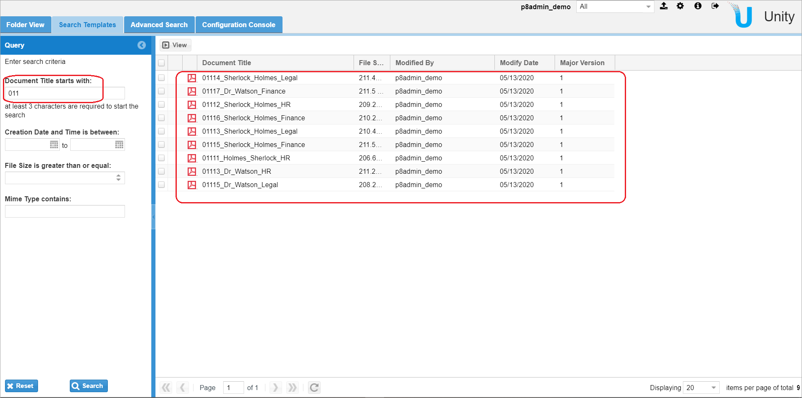

# Installing Unity for Salesforce

## Install UnityApp package using link

- Verify the link available to install UnityApp is available for the Salesforce Org it is going to be installed to
  Link for UnityApp version 2.2: [https://login.salesforce.com/packaging/installPackage.apexp?p0=04tf4000004PtwA](https://login.salesforce.com/packaging/installPackage.apexp?p0=04tf4000004PtwA)
- Login screen as shown in screenshot below will appear. Enter the credentials (Username and Password for the Org (e.g. `intellective-demo-qa-dev-ed-dev-ed.my.salesforce.com`) the package should be installed on):

  

- Select `Install for All Users` and click `Install` button:

  

- Check `Yes, grant access to these third-party web sites` and click `Continue`:

  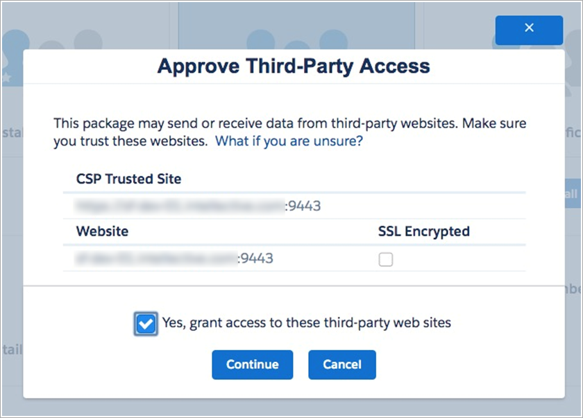

- Click `Done` when the installation is complete:

  

- On clicking `Done`, the page will be redirected to Installed Packages page with all installed packages:

  

## Package configuration in Salesforce

- Login to Salesforce
- Click `Setup`

  

- Go to `Users > User Management Settings`. Enable Enhanced Profile User Interface if not already enabled:

  

- Go to `Users > Profiles` and click on `System Administrator`:

  

- Click on `Assigned Apps`:

  

- Click on `Edit` and check the Visible checkbox for “Unity for Salesforce”. Save the changes:

  

- Go to `Security > Session Settings`, under “Extended use of IE11 with Lightning Experience” section check “I AGREE, Use IE11 with Lightning Experience during the Extended Period”. Click Save:

  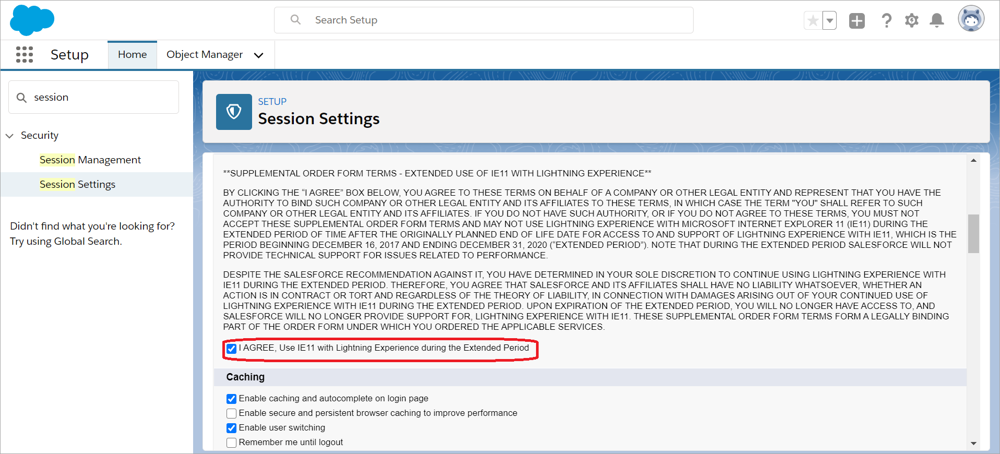

- Go to `Setup > My Domain`. If custom domain is already set skip this step, otherwise enter domain name, press `Check Availability` and `Register Domain` and then click `Deploy to Users` (if available):

  

- Go to `Identity > Auth. Providers`. Edit UnityOAuth2Provider if it exists, otherwise press `New` and select UnityOAuth2Provider in the Provider Type field:

  

- Enter the following fields and click `Save`:

  | Field                  | Value                                      | Notes          |
  | :--------------------- | :----------------------------------------- | :------------- |
  | Name                   | UnityOAuth2Provider                        |                |
  | URL Suffix             | UnityOAuth2Provider                        |                |
  | authorize-endpoint-url | callout:vu_nc/public/api/oauth/authorize   | see note below |
  | callback_url           | /services/authcallback/UnityOAuth2Provider |                |
  | consumer_key           | unity_client                               |                |
  | consumer_secret        | unity_secret                               |                |
  | token_endpoint_url     | callout:vu_nc/public/api/oauth/token       | see note below |
  | user_info_endpoint_url | callout:vu_nc/public/api/userinfo          | see note below |
  | Registration Handler   | Select UnityOAuth2RegHandler               |                |
  | Execute As             | Select current logged in admin user        |                |

  | **Note**: `vu_nc` should match the Named Credentials.

  

- Go to `Security > CSP Trusted Sites` and `Edit` Unity site name:

  

- Enter the following fields and click `Save`:

  | Field             | Value                                 | Example                          |
  | :---------------- | :------------------------------------ | :------------------------------- |
  | Trusted Site Name | any unique name                       | Unity                            |
  | URL Suffix        | `https://<Unity server>:<Unity port>` | https://sf-demo.vegaecm.com:9443 |

  

- Go to `Security > Remote Site Settings` and `Edit` Unity site name:

  

- Enter the following fields and click `Save`:

  | Field                     | Value                                 | Example                          |
  | :------------------------ | :------------------------------------ | :------------------------------- |
  | Remote Site Name          | any unique name                       | Unity                            |
  | Remote URL Site           | `https://<Unity server>:<Unity port>` | https://sf-demo.vegaecm.com:9443 |
  | Disable Protocol Security | checked                               |                                  |

  

- Go to `Security > Named Credentials` and edit `vu_nc` if it exists or create a new Named Credential with the following information and click `Save`:

  | Field                             | Value                                                      | Example                             |
  | :-------------------------------- | :--------------------------------------------------------- | :---------------------------------- |
  | Label                             | vu_nc/public/api/oauth/authorize                           |                                     |
  | Name                              | vu_nc/public/api/oauth/authorize                           |                                     |
  | URL                               | `https://<Unity server>:<Unity port>/<Unity_context_root>` | https://sf-demo.vegaecm.com:9443/vu |
  | Identity Type                     | Per User                                                   |                                     |
  | Authentication Protocol           | OAuth 2.0                                                  |                                     |
  | Authentication Provider           | UnityOAuth2Provider                                        |                                     |
  | Scope                             | api                                                        |                                     |
  | Start Authentication Flow on Save | checked                                                    |                                     |

  

- Check that correct Unity application login dialog is opened and enter correct login and password

- Open Unity for Salesforce app:

  

## Configure authentication between Salesforce and Unity

- Go to `Settings` under User profile:

  

- Go to `Authentication Settings for External Systems`. Edit `vu_nc` if it exists otherwise create New setting with the information below and click `Save`:

  | Field                             | Value                         |
  | :-------------------------------- | :---------------------------- |
  | External System Definition        | Named Credential              |
  | Named Credential                  | vu_nc                         |
  | User                              | Select current logged in user |
  | Authentication Protocol           | OAuth 2.0                     |
  | Authentication Provider           | UnityOAuth2Provider           |
  | Start Authentication Flow on Save | checked                       |

  

- Check that correct Unity application login dialog is opened and enter correct login and password

## Configure Unity tab in Salesforce

- Login to Salesforce
- Click `Setup`:

  

- Go to `Tabs` and Click `New` on the Lightning Component Tabs:

  

- Enter the information below to create the new tab and click `Save`:

  | Field               | Value                                                                                                                                                                              | Example                        |
  | :------------------ | :--------------------------------------------------------------------------------------------------------------------------------------------------------------------------------- | :----------------------------- |
  | Lightning Component | c:UnitySearchTemplatesTab (deployed package), Intellective2:UnitySearchTemplatesTab (installed package)                                                                            |                                |
  | Tab Label           | Any unique Tab name that will be displayed in the Salesforce                                                                                                                       | Documents Search               |
  | Tab Name            | Should be matched with Tab Id that was configured in the Unity application. This ID can be used only for one Tab. Template IDS must be under 40 characters and contain underscores | sharepoint_documents-templates |
  | Tab Style           | Select from the list                                                                                                                                                               | Lightning                      |

  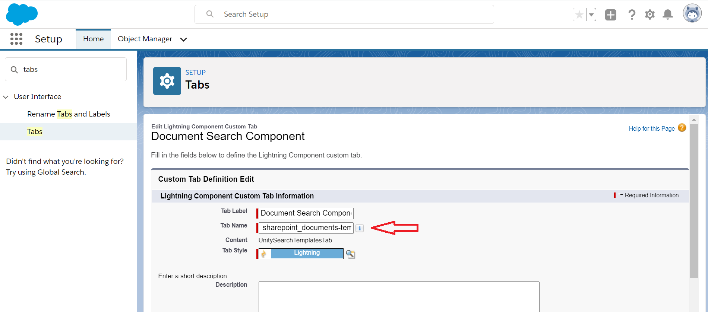

- Go to App Manager and click `Edit` for `Unity for Salesforce`:

  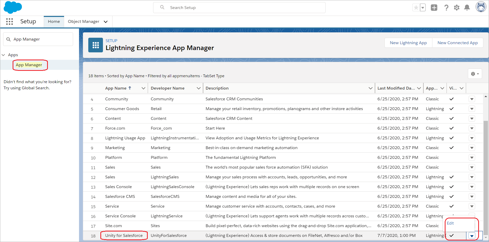

- Click `Navigation Items` and select `Documents Search` tab as created above from Available Items and click `Save`:

  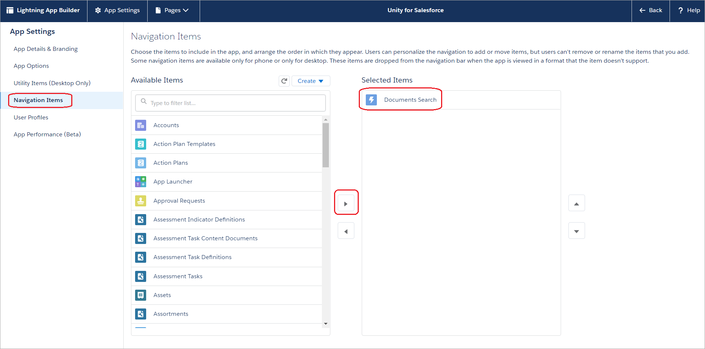

- Open Unity from the App Launcher:

  

## Configure reCAPTCHA (Optional)

- Add the following parameter to the SystemProperties section of Unity configuration file:

  ```xml
  <Property ID="captcha.enabled" value="true"/>
  ```

- Login to [https://www.google.com/recaptcha/admin](https://www.google.com/recaptcha/admin) and register a new domain:

  

- Copy the generated keys and add them to `<Unity installed application>/vu.war/WEB-INF/lib/vu-auth-provider-<unity version>.jar/auth.properties` to the following properties:

  google.recaptcha.key.site = site key

  google.recaptcha.key.secret = secret key

  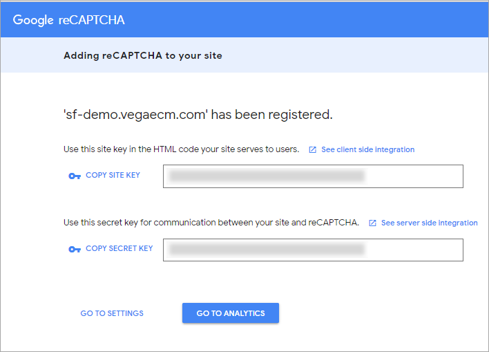

- In WebSphere admin console, go to `Security > SSL certificate and key management > Key stores and certificates > NodeDefaultTrustStore > Signer certificates`:

  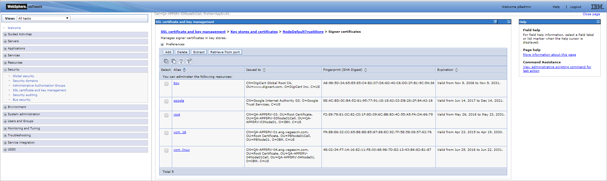

- Click `Retrieve from port` button, and specify Host `google.com`, Port `443`, and Alias `google`:

  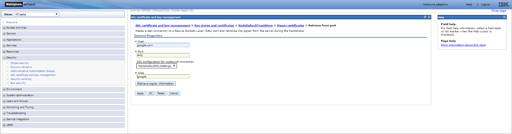

- Click `Retrieve signer information` button:

  

- Press `Apply` and restart WebSphere

# Verify Installation of Unity for Salesforce

- Login to Salesforce
- Open Unity from the App Launcher, if not already open:

  

- `Documents Search` tab is displayed by default and the search is auto-executed to display the documents from FileNet CE:

  

- Click on `View` action to view the document:

  

## Unity Validator

Unity Validator is a great tool, that allows to test main Salesforce settings and provides brief information on main possible reasons in case of problems:


In most cases error messages allow to understand what is wrong.
How to add Unity Validator tab:

- Go to `Setup > Profiles` and click on profile name, e.g. System Administrator
- In `Find Settings…` box type `Unity Validator`
- Select found result (it belongs to Object Settings)
- Ensure that tab is not hidden, i.e. Tab settings set to `Default On`:

  

- If it’s hidden, click `Edit` button and change visibility. Click `Save`:

  

- Go to `Setup > App Manager`
- Find `Unity for Salesforce Application` and click `Edit`:

  

- Go to `Navigation Items`
- Ensure that `Unity Validator` tab is presented under Selected Items:

  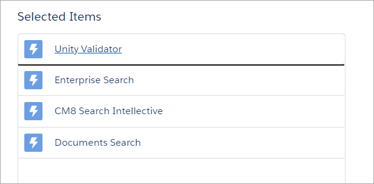

- If it’s not there, select Unity Validator under Available Items and click arrow button between 2 lists
- Click `Save`

# Un-installing Unity for Salesforce

## Un-install UnityApp package

- Login to Salesforce
- Click Setup:

  

- Go to `Custom Code > Custom Metadata Types`. Find Unity OAuth settings and click `Manage Records`:

  

- Delete `UnityOAuth2Provider` by clicking on `Del` link:

  

- Go to `Security > Named Credentials` and delete `vu_nc`:

  

- Go to `Identity > Auth. Providers` and delete `UnityOAuth2Provider`:

  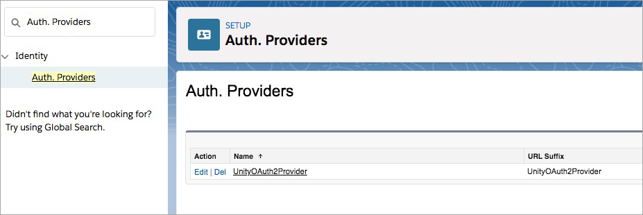

- Remove global components from all layouts where they were added
- Remove other dependent components if there is any
- Go to `Apps > Installed Packages` Uninstall UnityApp:

  

- Select options as shown on screenshot below and click `Uninstall`:

  
