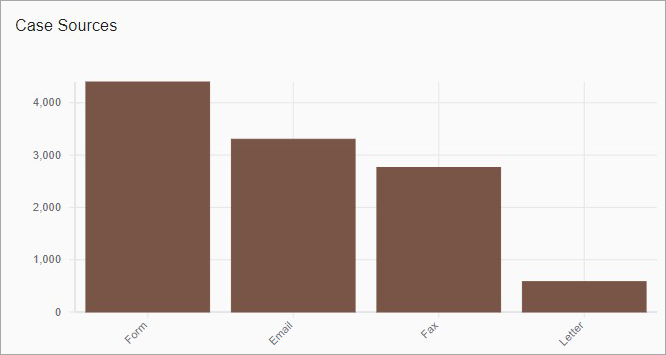
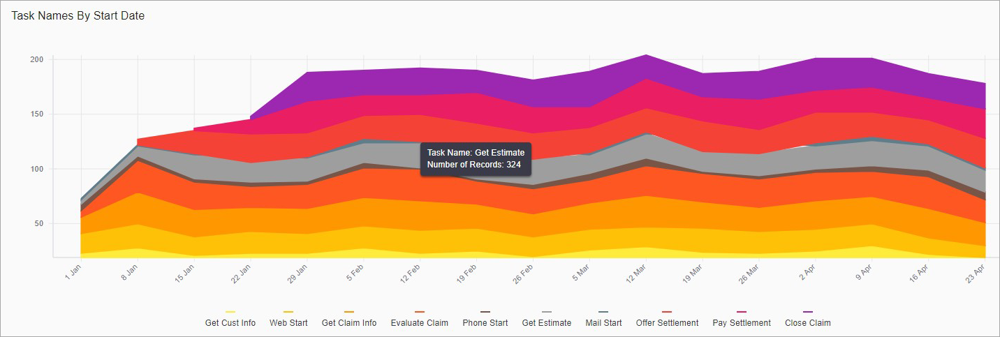

# Overview

# Charts

Charts are UI components designed for graphical representation of data.

Please refer to [Charts Configuration Section](../configuration/ui-components.md#charts) for more information about charts configuration. 

## Plot Charts

### Bar Chart

The **Bar Chart** presents categorical data with rectangular bars with heights or lengths proportional to the values that they represent. The bars can be plotted vertically or horizontally. A vertical bar chart is sometimes called a **Column Chart**.

The Bar Chart shows comparisons among discrete categories. One axis of the chart shows the specific categories being compared, and the other axis represents a measured value: 

 

The Bar Chart component is built based on [React-Vis Bar chart](https://uber.github.io/react-vis/documentation/series-reference/bar-series).

### Line Chart

The **Line Chart** displays information as a line segments. The Line Chart is often used to visualize a trend in data over intervals of time. The lines can be plotted vertically or horizontally: 

 

The Line Chart component is built based on [React-Vis Line chart](https://uber.github.io/react-vis/documentation/series-reference/line-series).

### Mark Chart

The **Mark Chart** displays discrete information. The marks can be plotted vertically or horizontally: 

 

The Mark Chart component is built based on [React-Vis Mark chart](https://uber.github.io/react-vis/documentation/series-reference/mark-series).

### LineMark Chart

The **LineMark Chart** displays information as a series of data points called 'marks' connected by straight line segments. The LineMark Chart is often used to visualize a trend in data over intervals of time. The lines and marks can be plotted vertically or horizontally.

The LineMark Chart is a combination of a [Line Chart](#line-chart) and a [Mark Chart](#mark-chart): 

 

The LineMark Chart component is built based on [React-Vis LineMark chart](https://uber.github.io/react-vis/documentation/series-reference/line-mark-series).

### Area Chart

The **Area Chart** displays graphically quantitative data. It is based on the [Line Chart](#line-chart). 
The Area Chart is often used to visualize a trend in data over intervals of time. The areas can be plotted vertically or horizontally: 

 

The Area Chart component is built based on [React-Vis Area chart](https://uber.github.io/react-vis/documentation/series-reference/area-series).

### Composite Chart

Several Plot charts can be combined into one Composite Chart.

*Content to be added*

## Radial Charts

### Pie Chart

The **Pie Chart** (Radial/Circle Chart) is a circular statistical graphic, which is divided into slices to illustrate numerical proportion. 
In the Pie Chart, the arc length of each slice (and consequently its central angle and area), is proportional to the quantity it represents: 

You can configure the Pie Chart to illustrate the numerical distribution of facet data.

The recommended type of information to display in this way is groups of less **6** or so. More than that becomes pretty hard to compare, and the reader just sees visual noise.

Pie charts can be replaced in most cases by other charts such as the [Bar Chart](#bar-chart), [Line Chart](#line-chart), [Area Chart](#area-chart), etc.

The Pie Chart component is built based on [React-Vis Radial chart](https://uber.github.io/react-vis/documentation/other-charts/radial-chart).

## Hierarchical Charts
    
### Tree Map

*Content to be added*

### Table Heat Map

*Content to be added*

### Sunburst

[IB-1091](https://jira.intellective.com/browse/IB-1091)

*Content to be added*

# Indicators

*Content to be added*

# Facets

Facets are used for aggregating data and calculating metrics about that data.

There are two main types of facets:

- Facets that partition or categorize data (the domain) into multiple categories: `TERMS` and `RANGE` facets
- Facets that calculate data for a given category (normally a metric, statistic or analytic function): `METRICS` facet

Please refer to [Facets Configuration Section](../configuration/facets.md) for more information about facets configuration. 

# Configurable
# Grid 
# Search Criteria 
# Range slider 
# Pivot
# Chart drill down capability
[IB-616](https://jira.intellective.com/browse/IB-616) 

# Show/hide dashboard components
[IB-767](https://jira.intellective.com/browse/IB-767) 

# Ability to add a custom component
# Ability to clusterize/bundle components into containers
# Saved Filters
# Data Export
