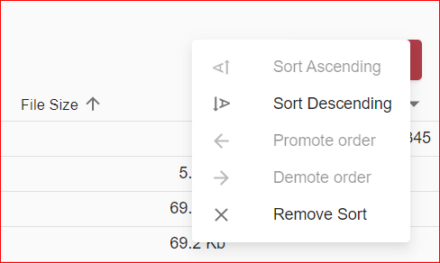

# Grouping  
*Content to be added*

# Multiple Column Sorting

You can configure the default Grid to allow multiple columns to be sorted at a time within the content list. React and classic Unity UI have slightly different implementation of this feature.

This feature implemented for:

- Tabs: Search Template, Folder View, Advanced Search
- Data Providers: FileNet, CMIS, UIE (except JOIN function) 

[Configure Multiple Column Sorting](../configuration/grids.md)

## Classic UI

To use a multiple column sorting grid, click the header of a column. The grid sorts to that column (toggling between ascending or descending), and a number (1) appears next to that header. This number indicates that column is the primary sort column.  

To sort by a second column, click the header for another column. The grid sorts to that column (toggling between ascending or descending) while maintaining the sorting of the primary sort column, and a number (2) appears next to that header. This number indicates the column is the secondary sort column.

Continue until you reach the max number of sort columns (3 by default): 

 

## React UI
To sort grid by a column, move mouse over the column header and grayed out arrow (sorting direction indicator) will appear. Clicking to column will activate ascending sorting. Next click will toggle sorting to descending, and third click will remove sorting for the column, and so on.

 

Sorting direction may be changed also via column menu. Click to down-pointing triangle in the column header, and menu will open. There are options _Sort Ascending_, _Sort Descending_ and _Remove sort_ that work as per above. 

 

Activating sort by a column when already having another column sorted will show columns sorting order numbers along with sorting direction arrows. Data firstly will be sorted by column with order number 1, then by column with number 2 etc.  

It is allowed to have up to 6 columns sorted simultaneously per grid. To change column sorting order number there are commands _Promote order_ and _Demote order_ in the column menu. Promoting reorders sorting by decrementing column order and demoting increments it. 

 

Per each grid, user defined sorting order is saved into browser storage and restored on next session.

# Column locking
*Content to be added*

# Column spanning 
*Content to be added*

# Column reordering
*Content to be added*

# Column menu
*Content to be added*

# Column cell formatting 
*Content to be added*

# Column cell tools and actions 
*Content to be added*

# Column cell rendering customization
*Content to be added*

# Record text links
*Content to be added*
 
# Multiple row selection
*Content to be added*
	
# Row action	
*Content to be added*

# Bulk action 
*Content to be added*

# Ability to add a custom grid action 
*Content to be added*

# Row actions menu 
*Content to be added*

# Expandable rows
*Content to be added*

# Pagination
*Content to be added*
	
# Ability to use a custom grid pagination 
*Content to be added*

# Infinite scrolling
*Content to be added*
	
# Data export 
*Content to be added*

# Display density settings
*Content to be added*
 
# Ability to compose with other components 
*Content to be added*

# Adaptive
*Content to be added*

# Responsive
*Content to be added*
	
# Configurable 
*Content to be added*

