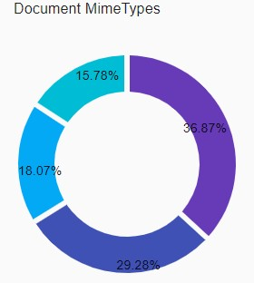

## General Information

The **Pie Chart** (Radial/Circle Chart) is a circular statistical graphic, which is divided into slices to illustrate numerical proportion. In the Pie Chart, the arc length of each slice (and consequently its central angle and area), is proportional to the quantity it represents.

You can configure the Pie Chart to illustrate the numerical distribution of facet data.

The recommended type of information to display in this way is groups of less **6** or so. More than that becomes pretty hard to compare, and the reader just sees visual noise.

Pie charts can be replaced in most cases by other charts such as the [Bar Chart](features-bar-chart.md), [Line Chart](features-line-chart.md), [Area Chart](features-area-chart.md), etc.

The Pie Chart component is built based on [React-Vis Radial chart](https://uber.github.io/react-vis/documentation/other-charts/radial-chart).



## Configuration

### Dashboard configuration

The Pie Chart can be configured as a Dashboard component.

The code snippet below describes a Dashboard configuration example that includes the Pie Chart. Please refer to [Dashboards](../feature-dashboard.md) for more information about dashboards configuration.

```xml
<Perspectives>
    ...
    <Perspective default="true" iconCls="perspective-cls" id="perspectiveId" title="perspectiveTitle">
        ...
        <Dashboard builder="default" default="true" iconCls="dashboard-cls" id="dashboardId" lazy="true" title="dashboardTitle" tooltip="dashboardTooltip">
            ...
            <Component cluster="breakdowns" layout="X4" ref="documents-by-mimetype-breakdown" type="chart"/>
            ...	
        </Dashboard>
        ...
    </Perspective>
    ...
</Perspectives>
```

### Chart configuration

The code snippet below describes a Pie Chart configuration example. Please refer to [Charts](features-charts.md) for more information about charts configuration.

```xml
<UiComponents>
    <Charts>
        ...
        <Chart id="documents-by-mimetype-breakdown" label="Document MimeTypes" type="pie">
            <Description>Document MimeType</Description>
            <Facets scope="analytics_repository">
                <Facet>mime-type-facet</Facet>
            </Facets>
        </Chart>
        ...
    </Charts>
</UiComponents>
```

| Please note that Pie Chart supports only one `Facet` definition in `Facets` section  

### Facet configuration
    
The code snippet below describes a facet configuration example. Please refer to [Facets](../facets/features-facet.md) for more information about facets configuration.    

```xml
<Facets>
    ...
    <Facet id="mime-type-facet" field="MimeType" type="TERMS"/>
    ...
</Facets>
```     

| Please note that Pie Chart supports only plain (one level) `TERMS` or `RANGE` facets. 

## Interaction

The Pie Chart is interactive. The following interaction modes are supported:

### Hover

View details of hovered slice


### Select

Select the slice. Multiple slice selection is supported.

