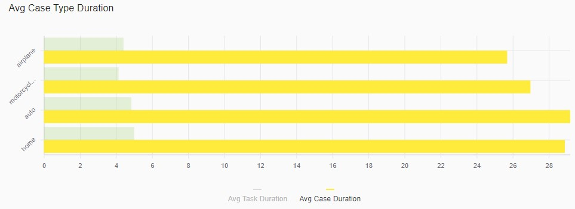

## General Information

The **Bar Chart** is a chart that presents categorical data with rectangular bars with heights or lengths proportional to the values that they represent. The bars can be plotted vertically or horizontally. A vertical bar chart is sometimes called a **Column Chart**.

The Bar Chart shows comparisons among discrete categories. One axis of the chart shows the specific categories being compared, and the other axis represents a measured value.

The Bar Chart component is built based on [React-Vis Bar chart](https://uber.github.io/react-vis/documentation/series-reference/bar-series).

 


## Configuration

### Dashboard configuration

The Bar Chart can be configured as a Dashboard component.

The code snippet below describes a Dashboard configuration example that includes the Bar Chart. Please refer to [Dashboards]() for more information about dashboards configuration.

```xml
<Perspectives>
    ...
    <Perspective default="true" iconCls="perspective-cls" id="perspectiveId" title="perspectiveTitle">
        ...
        <Dashboard builder="default" default="true" iconCls="dashboard-cls" id="dashboardId" lazy="true" title="dashboardTitle" tooltip="dashboardTooltip">
            ...
            <Component cluster="breakdowns" layout="X4" ref="cases-by-source-breakdown" type="chart"/>
            ...	
        </Dashboard>
        ...
    </Perspective>
    ...
</Perspectives>
```

### Chart configuration

The code snippet below describes a Bar Chart configuration example. Please refer to [Charts](features-charts.md) for more information about charts configuration.

```xml
<UiComponents>
    <Charts>
        ...
        <Chart id="cases-by-source-breakdown" label="Case Sources" type="vComposite">
            <Description>Cases By Source</Description>
            <Facets scope="analytics_repository">
                <Facet>case-source-facet</Facet>
            </Facets>
            <Plot height="300">
                <Series facet="case-source-facet" label="Case Source" type="bar"/>
            </Plot>
        </Chart>
        ...
    </Charts>
</UiComponents>
```

### Facet configuration
    
The code snippet below describes a facet configuration example. Please refer to [Facets](../facets/features-facet.md) for more information about facets configuration.    

```xml
<Facets>
    ...
    <Facet id="case-source-facet" field="CaseSource" type="TERMS"/>
    ...
</Facets>
```

## Interaction

The Bar Chart is interactive. The following interaction modes are supported:

### Hover

View details of hovered bar


### Select

Select the bar. Multiple bars selection is supported.


### Legend

Select the legend item. Multiple legend items selection is supported.

