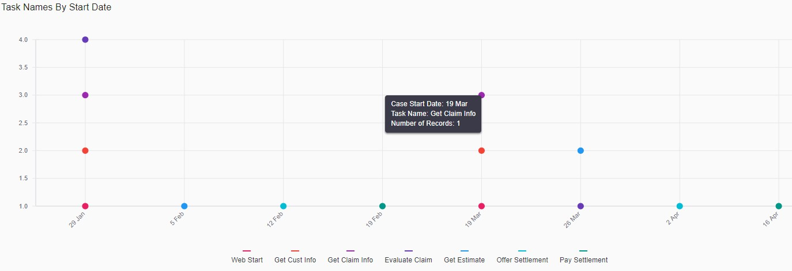
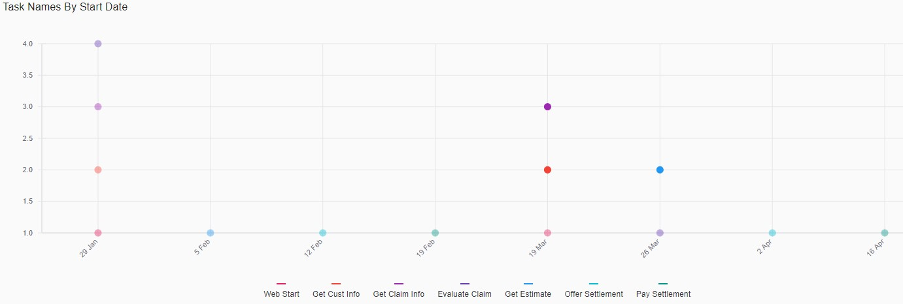
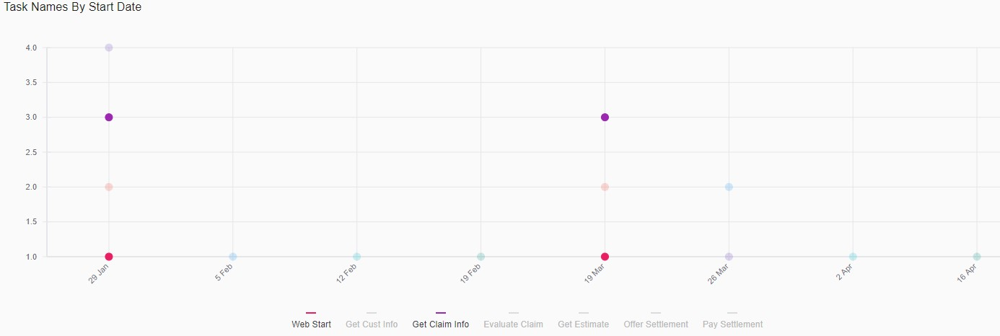

## General Information

The **Mark Chart** is a type of chart which displays discrete information. The marks can be plotted vertically or horizontally.

The Mark Chart component is built based on [React-Vis Mark chart](https://uber.github.io/react-vis/documentation/series-reference/mark-series).

 

## Configuration

### Dashboard configuration

The Mark Chart can be configured as a Dashboard component.

The code snippet below describes a Dashboard configuration example that includes the Mark Chart. Please refer to [Dashboards]() for more information about dashboards configuration.

```xml
<Perspectives>
    ...
    <Perspective default="true" iconCls="perspective-cls" id="perspectiveId" title="perspectiveTitle">
        ...
        <Dashboard builder="default" default="true" iconCls="dashboard-cls" id="dashboardId" lazy="true" title="dashboardTitle" tooltip="dashboardTooltip">
            ...
            <Component cluster="breakdowns" layout="X4" ref="tasks-by-start-date-breakdown" type="chart"/>
            ...	
        </Dashboard>
        ...
    </Perspective>
    ...
</Perspectives>
```

### Chart configuration

The code snippet below describes a Mark Chart configuration example. Please refer to [Charts](features-charts.md) for more information about charts configuration.

```xml
<UiComponents>
    <Charts>
        ...
        <Chart id="tasks-by-start-date-breakdown" label="Tasks By Start Date" type="vComposite">
            <Description>Tasks By Start Date</Description>
            <Facets scope="analytics_repository">
                <Facet>task-by-start-date-facet</Facet>
            </Facets>
            <Plot height="300">
                <Series facet="task-name-facet" label="Task Name" type="mark" stack="true" cluster="task-name-facet"/>
            </Plot>
        </Chart>
        ...
    </Charts>
</UiComponents>
```

### Facet configuration
    
The code snippet below describes a facet configuration example. Please refer to [Facets](../facets/features-facet.md) for more information about facets configuration.    

```xml
<Facets>
    ...
    <Facet id="task-by-start-date-facet" field="CaseStartDate" type="RANGE" gap="7d">
        <Facet id="task-name-facet" field="TaskName" type="TERMS"/>
    </Facet>
    ...
</Facets>
```

## Interaction

The Mark Chart is interactive. The following interaction modes are supported:

### Hover

View details of hovered mark



### Select

Select the mark. Multiple marks selection is supported.



### Legend

Select the legend item. Multiple legend items selection is supported.

