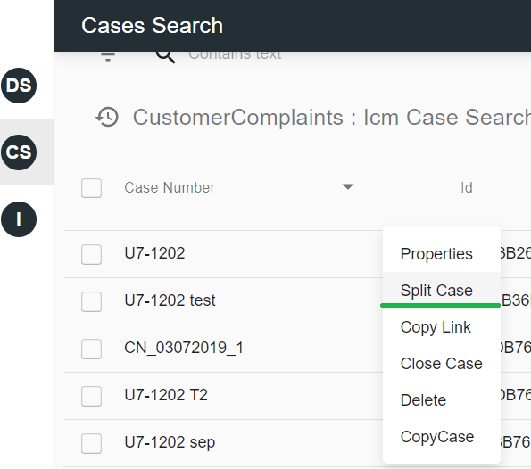
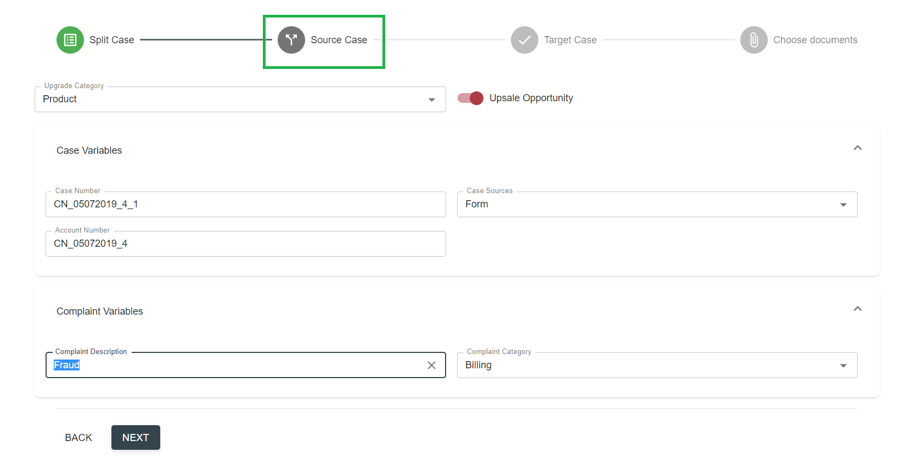

# Description

Split Case feature in React UI is implemented as a grid action available for Cases resources via grid's context menu:

 

Once selected, the action will be executed as a wizard with several steps:

- The first step is a Split Case where selected case is opened in read only mode for a preview. 
If more than one target case types available from the configuration, the list of target case types will be shown:
          

- Next step is a Source Case screen. It contains data from selected case in editable form where users can update values if needed or leave original data:

By selecting Next button in this screen, user actually triggers Case Split action execution in a backend system (i.e. IBM ICM).

- Upon successful completion the wizard opens next step Target Case with a preview form.

- Forth optional step is a screen where user is able to choose documents from source case and, by selecting 'Attach' button, link these documents with target case as well.

As a result new case will be created on top of existing case. Relevant information will be tracked in the history of the case:


     
# Configuration

Below Action configuration section should be added to the Unity System XML file.
 
```xml
    <Action ID="splitCase" multiselect="true" scope="single" type="toolbar">
      <Name>Split Case</Name>
      <IconCls>action-edit</IconCls>
      <Tooltip>Split Case</Tooltip>
      <Uri/>
      <Parameters/>
      <CustomParameters>
        <ResourceName>cases</ResourceName>
        <ActionType>split</ActionType>
		
<!-- Optional; used if need to replace view link for Original case page
        <ResourceType>CC_Complaint</ResourceType>
-->
<!-- Optional; used if need to replace view link for Original case page. If not specified View link from record will be used 
        <ViewType>Create</ViewType>
-->
 
<!-- The whole TargetResourceTypes is optional; if not specified case split page uses original case type/view -->
	<TargetResourceTypes viewType="Split"> <!-- viewType attribute is optional; if not specified Active Case view will be used -->
		<ResourceType>CC_Complaint</ResourceType>
		<ResourceType>CC_ComplaintProcessing</ResourceType>
	</TargetResourceTypes>
 
      </CustomParameters>
    </Action>
```

Action itself should be added to the actions list for grids:
  
```xml
<Grid ID="UCM_ICM_Case_Search_ComplaintsProcessing" enableColumnReorder="false" groupSearchResults="false">
      <Toolbar>
        <Actions>
          <Action ID="splitCase"/>
          <!-- other actions -->
        </Actions>
      </Toolbar>
      <!-- rest config-->
</Grid>        
```

If action configuration contains references to viewTypes, please make sure the proper views are defined in UCM Solution XML file:
```xml
<Tabs CaseType="CC_Complaint"  ViewType="Split">
    <Tab ID="1" Type="Details" Label="Properties" Tooltip="Properties" FieldSet="CaseReview">
        </Tab>
</Tabs>
```

