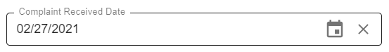

# Overview

Date picker is represented by input field and is intended for `date` properties: 

Clicking on  button will open up a dialog window with ability 
to select a single date:

Clear icon  becomes available at the right corner of the field on hover and 
allows to remove selected date value. 

# Configuration

[Common steps for properties view form field sets and fields configuration](../properties-view-form/supported-field-types#configuration)

*common steps for criteria panel to be added*

