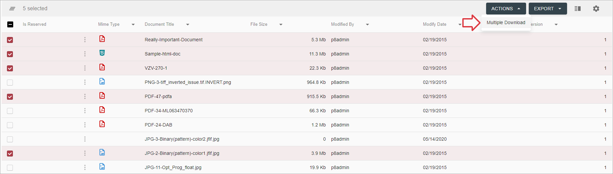

# Description

This feature allows downloading multiple documents as a ZIP archive.

# How to Download Multiple Documents

To download multiple documents:

- Using row checkboxes or `Select All` checkbox in the grid header, select documents that should be downloaded:

    

- Select `Multiple Download` from `Actions` bulk mode menu in the grid toolbar:

    
    
- While request is processing, loader with a backdrop is shown:

    
    
- You will be prompted to save zip archive, click `Save`:

    
    
    Documents will be zipped only if their number more or equal 2. Otherwise non-zipped document will be downloaded.
    
- If no errors occurred during action execution, the action completed successfully
        
- In case of failure, error message `Server Error` appears:

    

Successful action execution will also lead to grid refresh.

# Configuration

[Multiple Download action configuration](../../configuration/actions/multiple-document-download)