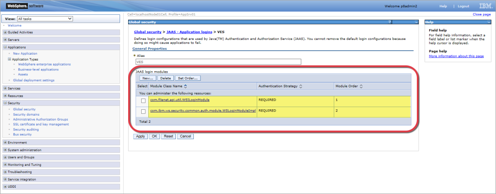
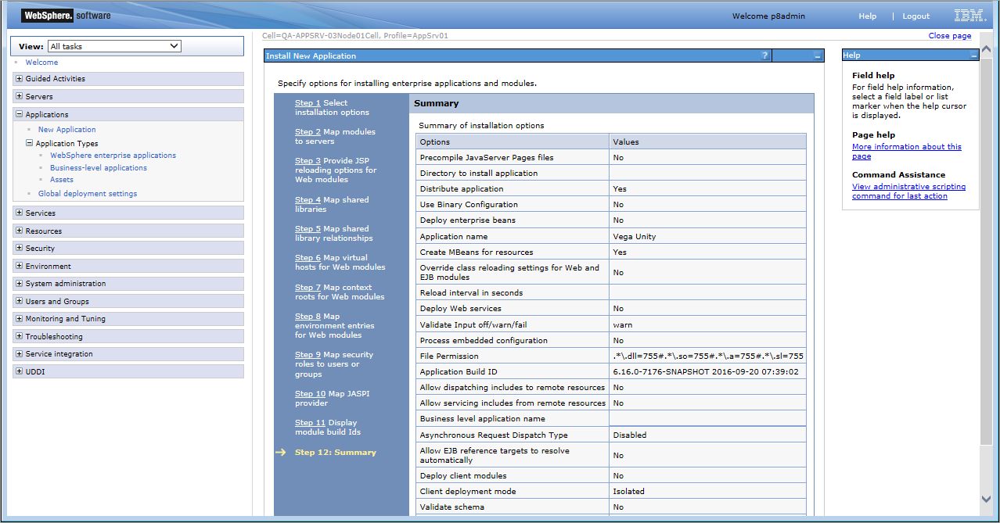
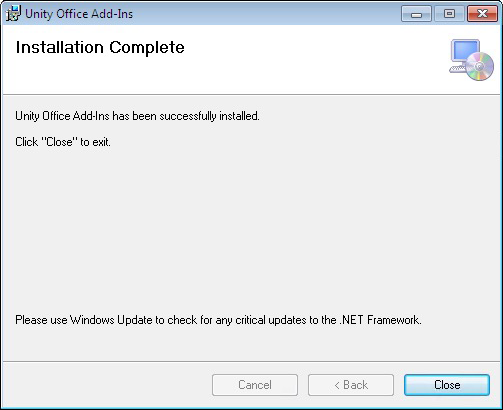
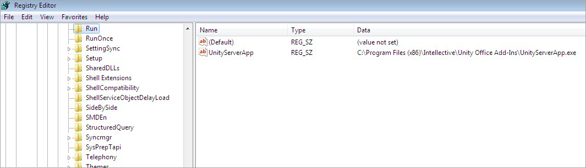

|**Note**: Unity Installation is the same for Unity ExtJS and Unity React.

# Introduction

This guide will cover WebSphere, WebLogic and jBoss/Wildfly specific deployments. You should follow the guides for the platform you will use for your deployment.
Once Unity is deployed, you can install and integrate additional components as needed in your planned Unity application such as Unity Intelligence Engine, a plug-in for Microsoft Office, or the User Audit module.

For the minimum third-party software applications required for setting up the infrastructure, see the [Unity 7 System Requirements](system-requirements).

For instructions on installing the Unity Enterprise Search, see:
- [Prerequisites for Enterprise Search Installation](../../enterprise-search/installation/prerequisites)
- [Enterprise Search Installation](../../enterprise-search/installation/installing-enterprise-search)

Unity is a flexible application with many installation options. Installation is a straightforward process once the supporting infrastructure is in place. It is highly recommended you read through the entire implementation guide to fully understand all options and decisions to make when planning your Unity installation.
The Unity distribution package includes pre-built EAR (Enterprise Application aRchive) files for IBM WebSphere and Oracle WebLogic.
You'll need to download the deployment files, prepare them for your system, then use a form_app authentication method to deploy the package and all its modules simultaneously to your application server.

# Versions Supported

The installation guide applies to all Unity 7 release versions unless otherwise indicated. 

- Unity 7.0
    - All 7.0 releases
     
- Unity 7.1
    - All 7.1 releases
        - 7.1.0 has added the IBM Case Manager Proxy support to allow for ICM to run on a different server. This is now configured during the installation.  Previous versions do not support this feature. 
    
- Unity 7.2
    - All 7.2 releases
        - In 7.2.0 Office Integration plug-in has changed – registry key is added on the user’s machine and application works in the background. In addition to the system changes, the Office Integration plug-in now support IE, Chrome and Firefox browsers. Previous versions worked via ActiveX object and in IE only. 
        - UCM Login module and datasources should be configured
        - WebLogic supported
        - JBoss Supported – either Wildfly (a.k.a JBOS AS) or JBOSS ERP
    
- Unity 7.5
    - All 7.2 releases
        - FileNet connector supporting for Unity under JBoss
 
- Unity 7.6
     - All 7.6 releases
        - Configuration Console: Search users and groups in LDAP

- Unity 7.7
    - All 7.7 releases

- Unity 7.8
    - All 7.8 releases


# Download the Deployment Files

Each EAR file contains a complete Unity application package with one or more modules in a single archive.

To download the deployment files:

1. Create a folder on your system called `<vu_install>`.

2. Download the UNITY Archive ZIP file from the FTP server.

3. Unzip the UNITY Archive ZIP file to your folder.

4. Navigate to the folder below that uses your application server and confirm the EAR files downloaded correctly: 
    - For WebLogic: `<vu_install>\VegaUnity\packages\webLogic`
    - For WebSphere: `<vu_install>\VegaUnity\packages\webSphere`
    - For JBOSS: `<vu_install>\VegaUnity\packages\jboss`
    
        

The above EAR files are pre-packaged with `form_app` authentication method and ready for deployment without any additional steps. 

The IBM FileNET CE client version is 5.2

Additionally, these EAR files have built-in Enterprise Search connector support (provider class: `com.vegaecm.vu.providers.uie.hli.Provider` or `com.vegaecm.vu.providers.ves.hli. Provider`  (deprecated name) or `com.vegaecm.vspace.providers.ves. VesQueryProvider` (deprecated name)).

# Deploy the Application on WebSphere

The instructions in this section only apply if you're using an IBM WebSphere application server. You need to have administrator access to the WAS console so you can configure the global security and install the application.

If you're using Oracle WebLogic, see [Deploy the Application on WebLogic](#deploy-the-application-on-weblogic).

## Configure the global security

The Global Security is the default security policy for all WebSphere applications. You need to add Enterprise Security and the Filenet JAAS Login Modules to your Global Security settings to ensure it receives the same security policy.

To configure the Global Security:

1. Open the WAS administrative console at the following path where `<ServerName>` is the name of your server:  
    `http://<ServerName>:9060/ibm/console`

2. Log into the system.

3. From the left navigation, open `Security > Global security`.

4. In the `Authentication` section, expand `Java Authentication and Authorization Service`:
 
    

5. Select `Application logins`.

6. Click `New…`.

7. For `Alias`, enter VES:

    

8. Click `Apply`.

9. Click `Save`.

10. In the JAAS Login Modules section, click `New…` and add the following login modules:

    |JAAS login module alias |	Module Class Name	|Authentication Strategy	|Module Order|
    |:-----------------------|:---------------------|:--------------------------|:-----------|
    |FileNetP8WSI	         |com.filenet.api.util.WSILoginModule	|REQUIRED	|1|
    |FileNetP8	             |com.ibm.ws.security.common.auth.module.WSLoginModuleImpl| REQUIRED	|2|
 
    
    
11. Click `Apply`, then `OK`.

## Configure WebSphere for WAS 9

To run Unity application at WAS 9, you need to set the following configuration property:

`com.sun.jersey.server.impl.cdi.lookupExtensionInBeanManager = true`

To configure WebSphere for WAS 9:
1. Open the WAS administrative console at the following path where `<ServerName>` is the name of your server:
    `http://<ServerName>:9060/ibm/console`.

2. Log into the system.

3. From the left navigation, open `Application Servers > [server] > Process definition > Java Virtual Machine > Custom properties`.

4. If it’s not listed, add the following property: 
    `com.sun.jersey.server.impl.cdi.lookupExtensionInBeanManager`.

5. Set `com.sun.jersey.server.impl.cdi.lookupExtensionInBeanManager = true`:
 
    

## Install using the Fast Path method

The Fast Path method focuses entering basic information, mapping modules to servers, and mapping virtual hosts for web modules. 

It applies the default settings for everything else. Many of these settings can be changed after installation as needed.

To install Unity using the Fast Path method:

1. Open the WAS administrative console at the following path where `<ServerName>` is the name of your server: `http://<ServerName>:9060/ibm/console`.

2. Log into the system.

3. From the left navigation, expand `Application > Application Types`, then select `WebSphere enterprise applications`.

4. Click `Install`.

5. On the `Preparing for application installation` screen click `Browse...` and select the `vu.ear` file from your `<vu_install>` or `<ves>` folder (depending on your Unity implementation).

6. Click `Next`:
 
    

7. For `How do you want to install the application?`, select `Fast Path` and click `Next`:

    

8. In the `Select installation options` screen, enter an `Application name` and click `Next`:

    | **Note**: You cannot edit this name after installation.      

    
        
9. On the `Map modules to servers` screen, click `Next`.

10. On the `Map virtual hosts for Web modules` screen, click `Next` again.

11. Review the `Summary` section, then click `Finish` and `Save`:
 
    
    
12. If you need to change the Context Root, complete the following:
    
    a. Return to the `WebSphere enterprise applications` screen.
    
    b. Select your new Unity application name.
    
    c. Click `Context Root` For Web Modules.
    
    d. Edit the Context Root:
 
       
    
    e. Click `OK`, then click `Save`:
 
       
    
13. If you are using IBM Case Manager you will need to configure the Proxy Manager Connection string for Case Manager, complete the following:
    
    a. Return to the `WebSphere enterprise applications` screen.
    
    b. Select your new Unity application name.
    
    c. Click `Initialize parameters for servlets`.
    
    d. Edit the targetUri to connect to your IBM Case Manager Installation. The format is `http://<server IP>:<port>/CaseManager/`:

       
    
    e. Click `OK`, then click `Save`:
 
       
    
14. Select the Unity application and click `Start`.
  	
## Install using the Detailed method

The Detailed method gives you a chance to review and configure all the possible settings for the installation including focuses entering basic information, mapping modules to servers, and mapping virtual hosts for web modules. It applies the default settings for everything else. Many of these settings can be changed after installation as needed.

If you have already installed the application using the Fast Path method, you do not need to complete this section.

To install Unity using the Detailed method:

1. Open the WAS administrative console at the following path: `http://<ServerName>:9060/ibm/console` where `<ServerName>` is the name of your server.

2. Log into the system.

3. From the left navigation, expand `Application > Application Types`, then select `WebSphere enterprise applications`.

4. Click `Install`.

5. On the `Preparing for application installation` screen click `Browse...` and select the `vu.ear` file from your `<vu_install>` or `<ves>` folder (depending on your Unity implementation).

6. Click `Next`:
 
    
    
7. For `How do you want to install the application?`, select `Detailed` and click `Next`.

8. In the `Select installation options` screen, enter an `Application name` and click `Next`: 

    

9. Edit the module targets on the `Map modules to servers` screen as needed and click `Next`.

10. Edit the settings on the `Provide JSP reloading options for Web modules` screen as needed and click `Next`.

11. Edit the shared libraries for the application and modules on the `Map shared libraries` screen as needed and click `Next`.

12. Edit the asset or composition IDs for reference on the `Map shared libraries relationships` screen as needed and click `Next`.

13. Edit the targetUri to connect to your IBM Case Manager Installation. The format is `http://<server IP>:<port>/CaseManager/` and click `Next`:
 
    

14. Edit the virtual hosts on the `Map virtual hosts for Web modules` screen as needed and click `Next`.

15. Edit the Context Roots on the `Map context roots for Web modules` screen as needed and click `Next`:
 
    

16. Edit the `vSpaceConfigURL` value on the `Map environment entries for Web modules` screen as needed and click `Next`:
 
    
    
17. Edit the users and groups on the `Map security roles to users or groups` as needed and click `Next`.

18. Edit the JASPI providers on the `Map JASPI provider` screen as needed and click `Next`.

19. Review the build IDs on the `Display module build Ids` screen and click `Next`.

20. Review the `Summary` section, then click `Finish` and `Save`:
 
    

21. Replace the default `jaceXXX.jar` and `peXXX.jar` files in `<installed app>/WEB-INF/lib` with the `FileNet Jace.jar` and `pe.jar files` if FileNet other than 5.2 version will be used in Unity.

22. Return to the `WebSphere enterprise applications` screen, select your new Unity application name and click `Start`.

# Deploy the Application on WebLogic

The instructions in this section only apply if you're using an Oracle WebLogic application server. You need to have administrator access to the WebLogic Administrator console so you can configure the modules and install the application.
If you're using IBM WebSphere, see [Deploy the Application on WebSphere](#deploy-the-application-on-websphere).	

## Install the application EAR file	

To install Unity for WebLogic (appropriate Datasource should be configured in WebLogic console):

1. Open the `vu.ear` file and edit the `Connection String for Case Manager`, the `Context Root` and `Configuration File Path` values as needed. Default values are: 
    - Context-root = `vu`
    - Configuration file path = `file:///opt/vu/vega_unity.xml`
    - Connection String for Case Manager = `http://localhost:9080/CaseManager/`

2. Open the WebLogic administrative console at the following path: `http://<ServerName>:7011/console/console.portal` where `<ServerName>` is the name of your server.

3. In the `Domain Structure` section, select `Deployments`.

4. Click `Install`.

5. On the `Preparing for application installation` screen click `Browse...` and select the vu.ear file from your `<vu_install>` or `<ves>` folder (depending on your Unity implementation.)

6. Click `Next`.

7. In the `Path` field, enter the file location of the `vu.ear` file:
 
    
    
8. Select `vu.ear` and click `Next`.

9. Select `Install this deployment as an application` and click `Next`:
 
    
    
10. Edit the `Name` as needed and click `Next`:
 
    
    
11. Click `Finish`, then `Save`.

12. Review the messages at the top of the page to confirm the updates:
 
    
    
13. In the `Domain Structure` section, select `Deployments`.

14. Select your new Unity application name and click `Start`.

# Deploy the Application on JBoss	

The instructions in this section only apply if you're using an JBOSS application server. Note that Unity on JBOSS can’t connect to the FileNet that’s why FileNet searching or ICM will not work.

If you're using IBM WebSphere, see [Deploy the Application on WebSphere](#deploy-the-application-on-websphere).

If you’re using Oracle WebLogic, see [Deploy the Application on WebLogic](#deploy-the-application-on-weblogic).

## Install the application EAR file

To install Unity for JBOSS (appropriate Datasource should be configured in `<JBOSS>/standalone/standalone-full.xml`):

1. Add the following parameters to the `<JBOSS>/standalone/standalone-full.xml` file for the first time installation:

    ```xml
    <subsystem xmlns="urn:jboss:domain:security:1.2">
        <security-domains>
                    ……..
           <security-domain name="unity" cache-type="default">
               <authentication>
                   <login-module code="Remoting" flag="optional">
                       <module-option name="password-stacking" value="useFirstPass"/>
                   </login-module>
                   <login-module code="RealmDirect" flag="required">
                       <module-option name="password-stacking" value="useFirstPass"/>
                   </login-module>
               </authentication>
        </security-domain>
    …..
    </subsystem>
    ```
2. Add the following parameters to the `<JBOSS>/standalone/standalone-full.xml` file for the first time installation for FileNet connection:

    ```xml
    <subsystem xmlns="urn:jboss:domain:security:2.0">
        <security-domains>
            <security-domain name="FileNetP8WSI" cache-type="default">
                <authentication>
                    <login-module code="com.filenet.api.util.WSILoginModule" flag="required"/>
                </authentication>
    		……………..
            </security-domain>
        </security-domains>
    </subsystem>
    ```
3. Open the `vu.ear` file and edit the `Connection String for Case Manager`, `Configuration File Path` (`vu.ear/vu.war/WEB-INF/web.xml`) and the `Context Root`(`vu.ear/META-INF/application.xml`) values as needed. Default values are: 
   - Context-root = `vu`
   - Configuration file path = `file:///opt/vu/vega_unity.xml`
   - Connection String for Case Manager = `http://localhost:9080/CaseManager/`

4. Copy `vu.ear` file to the `<JBOSS>/standalone/deployments` folder.
	
# Confirm your installation	

Now that you've installed your Unity application, you can confirm the installation and open the application by navigating to one of the following links:

- `http://<ServerName>:9080/<context_root>/main.jsp` for WebSphere
- `http://<ServerName>:7011/<context_root>/main.jsp` for WebLogic
- `http://<ServerName>:8080/<context_root>/main.jsp` for JBOSS 

Enter your login and password at the login screen, and verify the Unity application opens, your configured tabs appear on the screen, and no documents appear on the tabs.

# Integrate Unity with Microsoft Office

The Microsoft Office plug-in for Unity creates a new Unity tab in Microsoft Word, Excel, Powerpoint and Outlook for users to import files directly from the application to Unity.

It also allows users to use the Open in Office and Check Out and Open actions in Unity in IE, Chrome, Firefox browsers.
	
## Install the plug-in	

To install the plug-in:

1. Make sure you already downloaded the vu zip archive file.

2. Open the following file path: `<VU>/VegaUnity/packages/OfficeIntegration/`

3. Unzip the `VU_Office_Integration.zip` file to a new folder.

4. Run the setup file.

5. On the Welcome screen, click `Next`:
 
    

6. On the `Select Installation Folder` screen, enter the folder you just used to unzip the `VU_Office_Integration.zip` file and click `Next`:
 
    
    
7. On the `Confirm Installation` window, click `Next`:
 
    
    
8. Click `Yes`:
 
    

9. On the `Installation Complete` click `Close`:
 
    

10. Restart Windows if the message `Please restart Windows after Installation` appears during installation, otherwise it should work right away.

11. Open Microsoft Office Word, Excel, PowerPoint, Outlook and check that toolbar contains a new Unity tab.

## ActiveX adjustment	

1. From the menu bar, select `Internet Options > Security > Trusted Sites`.

2. Click `Sites`.

3. Uncheck `Require server verification (https:) for all sites in this zone` and click `Add`.

## Remove the plug-in

To remove the plug-in:

1. Open `Control Panel > Programs > Uninstall a program`.

2. Select  `Unity Office Add-Ins`:
 
    
    
3. Click `Uninstall`, then click `Yes`:
 
    
	
## Troubleshooting

1. UnityServerApp application.

    New UnityServerApp application was added to Office Integration Plug-In package. After installation, UnityServerApp is run in background and is listen for connections on a specific port (`http://locahost:27777`). It accepts jsonp request from Unity application, executes DLL function and sends back a response.
    After installation completed, following key will appear on user’s computer:      
    `SOFTWARE\Microsoft\Windows\CurrentVersion\Run\UnityServerApp`
     
    The exact path may depend on Windows version and can be found in System Configuration (`msconfig`):
 
    
    
    This registry key has a path to `UnityServerApp.exe` as a value:
     
    
    
    It allows automatically start UnityServerApp on Windows startup. This application works in background:
     
    
    
    For IE old algorithm is used (for backward-compatibility). It creates ActiveX object which allow to invoke functions inside DLL. If error happens on ActiveX object creation, new algorithm will be used.

2. Configure Unity tab in the Office application.

    a. Open `Office Application` > `File` > `Options`.
    
    b. Open `Add-ins` tab.

    c. In the bottom of Options pop-up in Manage drop-down select `COM Add-ins` and click `Go`:
 
      
    
    d. Make `Unity Add-in` enabled and click `OK`:
        
      
	
# Install the User Audit Module	

The User Audit module can be installed in the Unity application or as a standalone application.

## Integrate the User Audit Module with Unity	

If you already have a Unity application and want to integrate the User Audit module into it, you only need to set the appropriate configuration settings.

To integrate it with Unity:

1. Log into Unity and select the `Configuration Console` tab.

2. Expand the `Advanced Editor` section and select `global` for the Solution.

3. Expand the `Enterprise Solution > Configuration > User Audit` section.

4. Add the following snippet of code. Make sure to update the parameters as needed. All parameters are required.

    ```xml
    <?xml version="1.0" encoding="UTF-8"?>
    <Configuration>
    ......
           <UserAudit>       
               <AuditEnabled>true</AuditEnabled>
               <FilePath>/tmp/userlogin.csv</FilePath>
               <MaxFileSize>1024KB</MaxFileSize>       
               <LogPattern>sessionId;ip;username;date</LogPattern>
           </UserAudit>
    ......
    </Configuration>
    ```

5. Click `Apply` and then `Activate` to restart the application.

The parameters for the module include:

- `AuditEnabled` – this determines if the module is turned on. True means yes. False means no.
- `FilePath` – this is the path to the CSV statistics file that stores user audit information. This needs to be a valid path on the same machine as the Unity application.
- `MaxFileSize` – this determines how big the CSV statistics file can be before the system creates a new file.
- `LogPattern` – this determines the order of the data stored in the CSV statistics file. Possible values include `sessionId`, `ip`, `username`, and `date`.

## Install the User Audit Module as a standalone module

If you want to install the User Audit module as a standalone application using WebSphere and then deploy it to Unity, you need to integrate it with Unity as well as update Unity's `web.xml` file in WebSphere. 
This requires administrator access to the WAS console.

To install it as a standalone module:

1. Follow the steps in the previous section, [Integrate the User Audit Module with Unity](#integrate-the-user-audit-module-with-unity).

2. Stop the Unity application.

3. Copy the user audit module jar file to the following folder: `<VU>/VegaUnity/vspace.war/WEB-INF/lib`

4. Navigate to the following folder and open the `web.xml`: `<VU>/VegaUnity/vspace.war/WEB-INF/`

5. Add the following code to the root `web-app` section of the file:

    ```xml
    <filter>
                                    <filter-name>AuthLogFilter</filter-name>
                                    <filter-class>com.vegaecm.vspace.useraudit.AuthLogFilter</filter-class>
     </filter>
     
    <filter-mapping>
                                    <filter-name>AuthLogFilter</filter-name>
                                    <url-pattern>/</url-pattern>
     
     
    </filter-mapping>
    <filter-mapping>
                                    <filter-name>AuthLogFilter</filter-name>
                                    <url-pattern>*.jsp</url-pattern>
    </filter-mapping>
    <filter-mapping>
                                    <filter-name>AuthLogFilter</filter-name>
                                    <url-pattern>/services/*</url-pattern>
    </filter-mapping>
    <filter-mapping>
                                    <filter-name>AuthLogFilter</filter-name>
                                    <url-pattern>/servicesUT/*</url-pattern>
    </filter-mapping>
    <filter-mapping>
                                    <filter-name>AuthLogFilter</filter-name>
                                    <url-pattern>/downloadUT</url-pattern>
    </filter-mapping>
    <filter-mapping>
                                    <filter-name>AuthLogFilter</filter-name>
                                    <url-pattern>/DaejaGetContentLauncher</url-pattern>
    </filter-mapping>
    <filter-mapping>
                                    <filter-name>AuthLogFilter</filter-name>
                                    <url-pattern>/exportUT</url-pattern>
    </filter-mapping>
    <filter-mapping>
                                    <filter-name>AuthLogFilter</filter-name>
                                    <url-pattern>/view</url-pattern>
    </filter-mapping>
    <filter-mapping>
                                    <filter-name>AuthLogFilter</filter-name>
                                    <url-pattern>/viewUT</url-pattern>
    </filter-mapping>
    <filter-mapping>
                                    <filter-name>AuthLogFilter</filter-name>
                                    <url-pattern>/admin</url-pattern>
    </filter-mapping>
    <filter-mapping>
                                    <filter-name>AuthLogFilter</filter-name>
                                    <url-pattern>/adminUT</url-pattern>
    </filter-mapping>
    <filter-mapping>
                                    <filter-name>AuthLogFilter</filter-name>
                                    <url-pattern>/ut/*</url-pattern>
    </filter-mapping>
    ```

6. Open the WAS administrative console at the following path:

    `http://<ServerName>:9060/ibm/console` where `<ServerName>` is the name of your server.

7. Log into the system.

8. From the left navigation, expand `Application > Application Types`, then select `WebSphere enterprise applications`.

9. Select your Unity application and click `Update`:

    

10. Select `Replace or add a single file`.

11. Specify the relative path to the `web.xml` file.

12. Click Choose File and select the updated `web.xml` file:
 
    

13. Save your changes and start the application.

# Optional Installation Steps

- [Master Key configuration](unity-7-installation-guide/master-key)
- [CMOD configuration](unity-7-installation-guide/cmod-configuration)
- [UCM configuration](unity-7-installation-guide/ucm-configuration)
- [Alfresco configuration](unity-7-installation-guide/alfresco-configuration)  