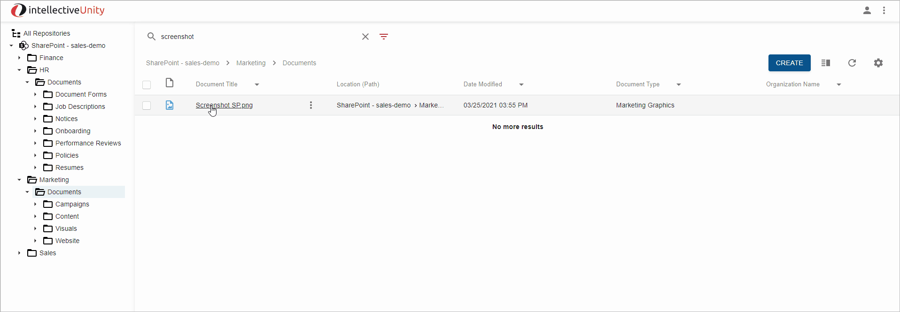

# How To Add a Border to Gif

In ScreenToGif app:

- Select `Image` tab
- Select `Border` tool
- Click color and set gray color R167 G167 B167 Alpha255
- Set `-1` for `Thickness` for all directions to add a border outside frames
- Click `Apply`:

- Select `File` tab
- Select `Save As` and save your gif

As a result, your gif will be shown with a gray border:
