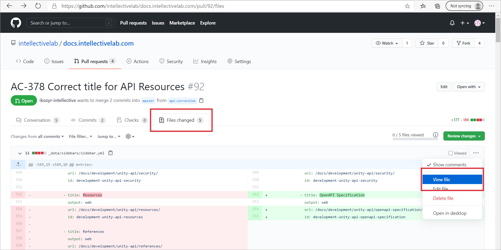

- Open pull request (PR) from [pull requests page](https://github.com/intellectivelab/docs.intellectivelab.com/pulls) 
- Select `Files changed` tab and look through changes in files
- Click `View file` from dropdown toolbar menu on the right:

    
    
    You will see a page almost how it will look on doc portal, images are shown and links work, but navigation tree and table of contents are not shown and styling may differ. 
    
- Check the files do not contain confidential information like passwords, customer data etc  
- To add a comment on `Files changed` tab click `+` sign near row number, it appears when hovering mouse on the row:

    

- To approve PR use `Review changes` button:

    
    
    You can comment PR or request changes instead.
    
- Do not merge PR even if there are all required approvals, merging will be performed by a technical writer (ikozyr-intellective) or doc portal support (ozimakov-intellective)
