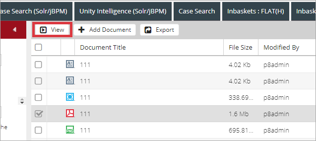

# Description

`View` document feature allows to open document(s) in viewer window(s).

# How to View Document(s)

- Select one or more documents in the grid:

    
    
- Click `View` in context menu or on a toolbar:

    

- These documents are opened in viewer in separate windows: 

    

*content to be added*

# Configuration

[View Document action configuration](../../configuration/actions/view-document.md)  
[Viewing multiple documents in separate Daeja viewer windows configuration](../../configuration/tags-list/system-properties-tag.md)
