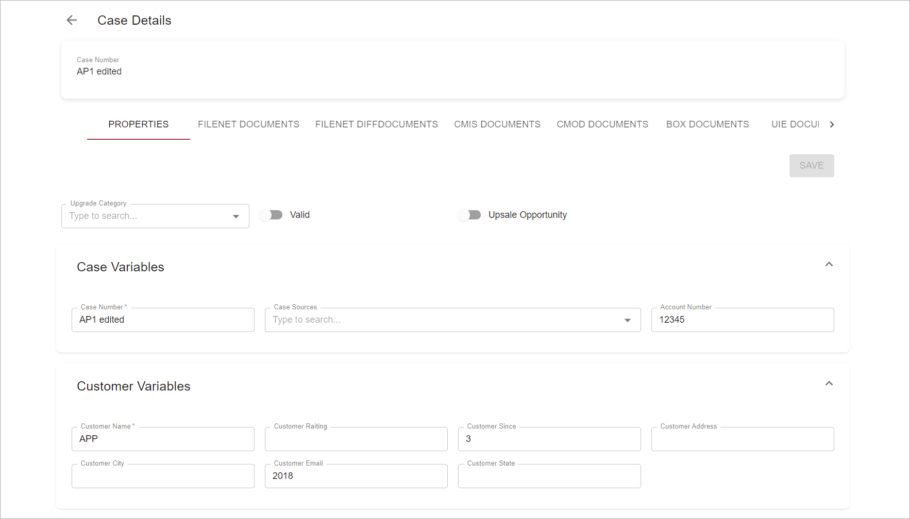

# Description

Case details view displays case data structured according layout/fieldset configuration as well as attached to the case documents, case history, comments and other possible relevant data.  
Case details view can be opened either in the same browser window in `dialog` or `sidebar` variants or in a separate browser tab.

# How to Use Case Details

To open Case Details from the grid:

- Click on Case Title
- Or open actions menu by clicking on the vertical ellipse icon consisting of three dots in the grid row and select `View Details` action from dropdown list:
   
    
     
- Or open actions menu and select `Open in Separate Tab` action from dropdown list to open Case Details in separate browser tab

Case Details opened:

Case Details view can be configured to have multiple tabs: 
- Properties tab
- [Attachments tab](case-attachments.md)
- [History/Comments tab](history-comments-tab.md)
- Tasks tab

Properties tab is shown by default when opening case details.  
User can edit case properties and save changes by clicking `Save` button.

# Configuration

[Case details action configuration](../../configuration/actions/case-details.md)  
[Open in separate tab action configuration](../../configuration/actions/open-in-separate-tab.md)  
[Tabs section configuration for case actions](../../configuration/tags-list/views-tag.md#tabs-section-configuration-for-case-actions)  