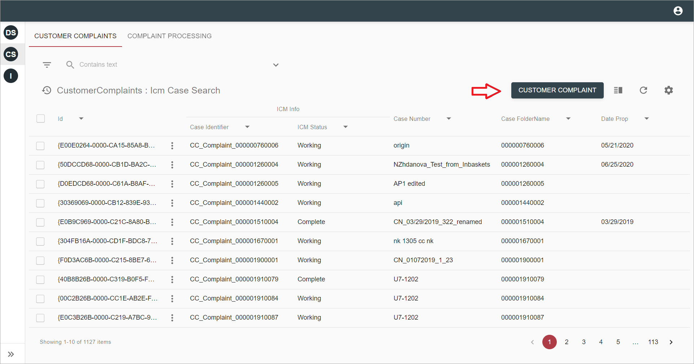
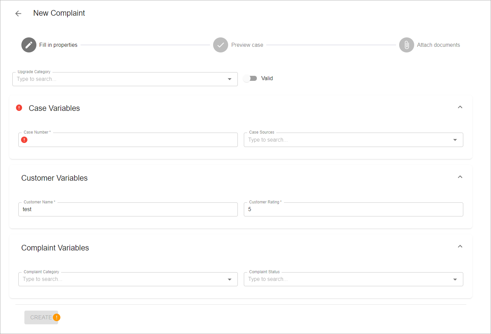
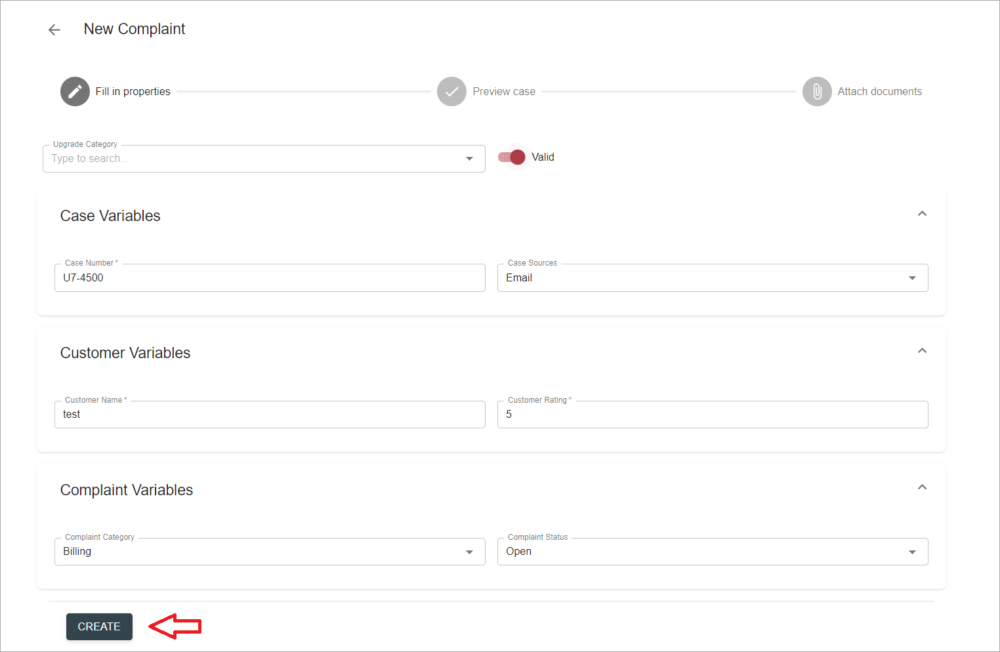

# Description

`Create case` action allows to create a case in case manager and attach files to it. It can be executed from a grid 
toolbar.

# How to create a case

Find create case associated button on grid toolbar and click it. On screenshot below this button has `Customer Complaint` label:

       
The action will be executed as a wizard with several steps: Fill in properties, Preview case and Attach documents.

- The first step is `Fill in properties` form where properties for new case can be specified:

    

- Fill in properties and click `Create` button:

    
    
- The second step is a `Preview case` form. It's similar to form on a previous step, however uses different set of fields, 
unless the same fieldset is specified for both `Create` and `Active` case views:

    
    
    Available actions: 
    
    `back` - remove just created case and return to the previous step
    
    `save` - update case properties
          
    `next` - move to the next step if you need to attach documents to this case
         
    `complete` - complete case creation wizard if you don't need to attach documents to this case

- The third step allows to attach documents to just created case. View is based on tabs with Type = `Attachments`, which
are defined in solution configuration file for `Active` cases.

    
    
    Available actions:
    
    `back` - return to the previous step
    
    `complete` - complete case creation wizard
    
# Configuration

[Create Case action configuration](../../configuration/actions/create-case.md)  
[Defining view for Create Case action](../../configuration/tags-list/views-tag.md)  
[Case attachments search template configuration](../../configuration/search-templates/case-attachments.md)  
