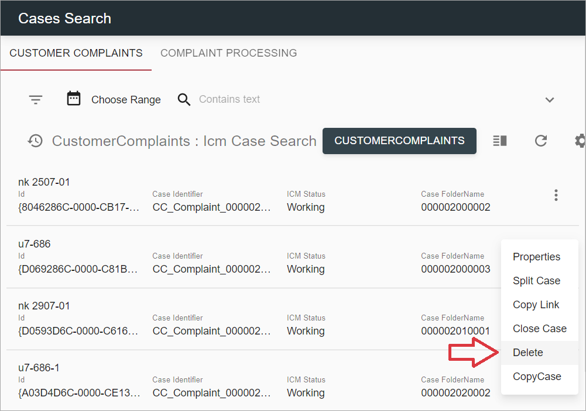

# Description

`Delete case` action allows to delete a case from case manager. It can be executed from grid context-menu or 
`Properties` tab of `Case Details` page. 

*content to be added*

# How to Delete a Case

## Delete a case from the grid

- Click on context menu icon of the case, that should be deleted

- Click `Delete` action

    

- Confirmation dialog will appear:

    

Clicking on `Cancel` button will lead to closing confirmation dialog without case deleting.

By selecting `Yes` button, user triggers `Delete` action execution. After case is deleted, grid page will be 
refreshed.

## Delete a case from Case Details

- Open `Case Details` by clicking row in grid / selecting `Edit` action from context-menu / opening case 
in a separate tab ...

- Click `Delete` button

    

- Confirmation dialog will appear:

    

Clicking on `Cancel` button will lead to closing confirmation dialog without case deleting.

By selecting `Yes` button, user triggers `delete` action execution. After case is deleted, `Case Details` 
will be closed. If case is opened from grid (via context menu `Edit` action or by clicking on a row), grid will be 
refreshed as well.

# Configuration

[Delete Case action configuration](../../configuration/actions/delete-case.md)
